# AI 学习笔记 全流程体系化完整版

> 一份从真实对话中提炼的体系化 AI 学习笔记。内容覆盖：**输入与 Transformer、训练与对齐、缓存与成本、Agent 与 RAG、算力硬件、模型生态、AI 产品经理与工程实践**。
>
> 原始素材：4 份聊天导出，共 **109 个用户回合**；不少回合一次包含十余个子问题。本文按“概念依赖关系”重排，而不是照聊天时间顺序堆放。
>
> 本文力求“通俗易懂 + 保留专业术语”，并配思维导图与流程图帮助建立体系。文末附有 **问题覆盖索引**，逐回合标注答案所在章节；对时效性产品信息单独标注核验原则。


---

## 目录

1. [知识体系总览（思维导图）](#0-知识体系总览)
2. [模块一 · 大模型基础](#模块一-大模型基础)
3. [模块二 · 训练与对齐](#模块二-训练与对齐)
4. [模块三 · Agent 体系](#模块三-agent-体系)
5. [模块四 · 算力与硬件](#模块四-算力与硬件)
6. [模块五 · 大模型生态](#模块五-大模型生态)
7. [模块六 · AI 产品经理视角](#模块六-ai-产品经理视角)
8. [模块七 · 深度原理追问（集中九问）](#模块七-深度原理追问集中九问)
9. [模块八 · 从自然语言到 Agent 交付的完整链路](#模块八-从自然语言到-agent-交付的完整链路)
10. [模块九 · 数据格式 工程控制 安全与上下文工程](#模块九-数据格式-工程控制-安全与上下文工程)
11. [问题覆盖索引](#问题覆盖索引)

---

## 0. 知识体系总览

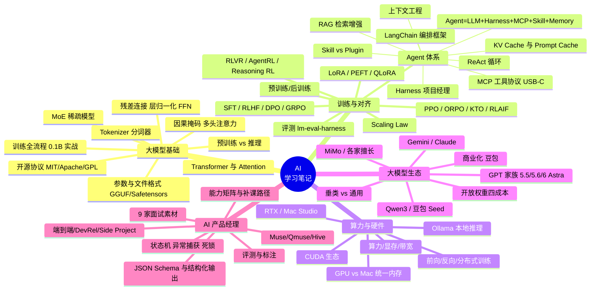

---

## 模块一 · 大模型基础

### 1.1 大模型参数及其文件表现形式

用户下载的「大模型参数」本质上是**成百上千万乃至上万亿个浮点数（权重）**，训练结束后被序列化成二进制文件。常见格式：

| 格式                         | 全称 / 特点                                                           | 典型使用方                  |
| -------------------------- | ----------------------------------------------------------------- | ---------------------- |
| **GGUF**                   | GPT-Generated Unified Format， llama.cpp / Ollama 专用，单文件、自带分词器与元数据 | 本地推理（Ollama、LM Studio） |
| **Safetensors**            | Hugging Face 推出，安全（无可执行代码）、极速加载的张量格式                              | HF 生态、训练/微调            |
| **PyTorch `.bin` / `.pt`** | 传统 `torch.save` 权重，兼容性最好但加载较慢、有安全隐患                               | 研究、旧模型                 |
| **AWQ / GPTQ**             | 量化（4-bit/8-bit）后的压缩权重，体积大幅缩小                                      | 显存受限的设备                |

> **体积参考**：一个 7B~8B 的 FP16 模型约 **13–14 GB**；量化到 4-bit 后可降到约 4–5 GB，才能在消费级显卡/ Mac 上跑起来。

### 1.2 Tokenizer（分词器）为什么重要

Tokenizer 把人类文本切成模型能处理的 **token（词元）**。token 不是固定的“词”，也不必是最小语义单元；它可能是一个字、子词、标点或字节片段。它重要在：

- 决定**词表大小**与**压缩率**——同样一段话，token 数越少，推理越快、越省显存；
- 多语言（尤其是中文）切分策略直接影响模型效果；
- 手写一个 BPE（Byte-Pair Encoding）Tokenizer 是从零训模型的第一步：先统计语料里最高频的字节/字符对，逐层合并成子词。

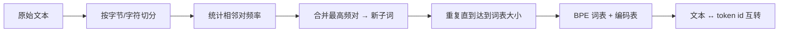

### 1.3 Transformer 与 Attention（注意力机制）

Transformer 是现代大模型的**统一架构**，预训练和推理都基于它（但计算方式不同：训练并行处理整段；推理自回归逐 token 生成）。

- **Attention（注意力）本质**：让每个 token 在理解自己时，「抬头看一眼」上下文里和它最相关的其他 token。
- **Q / K / V**：
  - **Q（Query 查询）**：「我在找什么信息」
  - **K（Key 键）**：「我这里有什么信息标签」
  - **V（Value 值）**：「我这里的具体信息内容」
  - 计算 **Q 与 K 的相似度**（点积 + softmax 得到权重），用权重**加权求和 V**，得到融合了全局上下文的新表示。这个加权后的 V 直接用于**预测下一个 token**。
- **前馈神经网络（FFN）**：Attention 之后对每个位置独立做的两层全连接变换，负责「消化」注意力聚合来的信息、增加非线性表达力。神经网络（含 FFN）整体负责把输入映射到输出、拟合复杂函数。

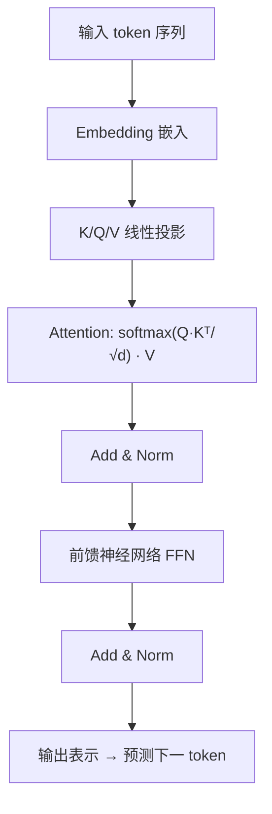

> **预训练 vs 推理中的 Q/K/V**：两者都会产生 Q/K/V，因为都是把文本送进同一套 Transformer 算注意力。区别是预训练**没有 KV-Cache**（一次性并行算完整个序列），而推理为了生成第 N 个 token，会把前面所有 token 的 K/V 缓存下来（KV-Cache），避免每次重新计算历史。

### 1.4 预训练 vs 推理（训练的本质）

- **训练的本质**：调整海量浮点参数，使「给定前文，预测下一个字」的错误尽可能小。不是把书本背下来，而是统计学习人类语言的模式、事实与逻辑，最终产出一堆权重文件。
- **训练（造模型）**：输入海量文本 → 反复前向 + 反向传播 + 梯度更新 → 成本极高，需成千上万 GPU → 产出权重。
- **推理（用模型）**：加载训练好的权重 → 只做前向计算生成回答 → **不改动任何参数** → 可单卡 / 手机 / 本地。
- **联系**：训练产出权重，推理消费权重；推理效果上限由训练质量决定。
- **类比**：训练＝反复刷题并不断修改笔记；推理＝拿着写完的笔记做题，笔记不再修改。

> **iOS vs Windows 类比芯片**：Windows 工作站 = GPU 训练集群（可插多卡、吃巨量显存、做分布式重型计算）；iOS 手机 = 终端（NPU 只能跑轻量模型推理，完全做不了万亿级训练，内存/算力/带宽全不够）。

### 1.5 从零训一个 0.1B 模型的完整流程

用户提出的「硬核实战清单」可拆为以下阶段（这也是理解大模型训练全貌的最佳路径）：

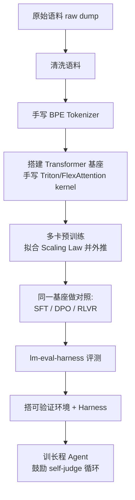

- **raw dump 清洗**：去重、去噪、过滤低质/隐私数据，是质量基石。
- **手写 kernel**：用 Triton（NVIDIA）或 FlexAttention（Apple/跨平台）手写 attention 算子，测多卡训练/推理的性能增益——这是理解底层性能的关键。
- **Scaling Law**：用小规模实验拟合「参数量/数据量/算力 →  loss」的关系，再外推到更大规模该投多少资源。
- **对照实验**：在同一基座上分别跑 SFT / DPO / RLVR，直观对比不同对齐方式的效果。
- **评测**：用 lm-eval-harness 跑标准基准。
- **Agent**：最后接上 Harness，训能自我审视（self-judge）的长程 Agent。

### 1.6 MoE 稀疏模型（总参数 vs 激活参数）

稠密模型（Dense）每次推理都要激活全部参数；**MoE（混合专家）** 把参数分成多个「专家」，每个 token 只路由激活其中少数几个。

- 某个 MoE 可以拥有很大的总参数池，但每个 token 只经过少数专家；若引用 MiMo 等具体型号的参数数字，应以对应版本的官方技术报告为准。
- 具体商业模型是否采用 MoE、总参数与激活参数是多少，必须以官方技术报告为准；用户产品还可能在多个模型之间路由。

> 对 MoE 应分别报告总参数、每 token 激活参数和实测计算量；三者不能相互替代，也不能只凭参数量推断效果。

### 1.7 开源协议：MIT / Apache 2.0 / GPL

| 协议             | 宽松度        | 关键差异           | 典型模型             |
| -------------- | ---------- | -------------- | ---------------- |
| **MIT**        | 最宽松        | 几乎无限制，只需保留版权声明 | Qwen 部分、众多开源项目   |
| **Apache 2.0** | 宽松         | 含专利授权条款，商用友好   | Qwen3-8B、Llama 系 |
| **GPL**        | 强 copyleft | 衍生作品必须同样开源     | 较少用于大模型权重        |

> **MIT 协议**通俗说：你可以随意用、改、闭源商用，只要保留原作者署名即可。

### 1.8 一个 Transformer Block 里还发生了什么

只记住 Q/K/V 还不够。一个现代 Decoder-only LLM 的单层通常可以概括为：

```text
隐藏状态 x
  → LayerNorm / RMSNorm
  → 因果自注意力
  → 残差相加
  → LayerNorm / RMSNorm
  → FFN 或 MoE
  → 残差相加
  → 下一层
```

- **隐藏状态（hidden state）**：每个 token 在当前层的向量表示。它不是自然语言句子，而是一组浮点数。
- **多头注意力（Multi-Head Attention）**：把表示空间分成多个头。不同头可以学习不同关系，例如指代、位置、语法或长距离依赖；“一个头只负责一种关系”只是帮助理解的类比，不是硬规则。
- **因果掩码（Causal Mask）**：生成第 `t` 个位置时，禁止看见未来位置，避免训练时偷看答案。它通常把未来位置的注意力分数设为负无穷，softmax 后权重接近 0。
- **残差连接（Residual Connection）**：把子层输出加回原输入，形式近似 `y = x + F(x)`。它让信息和梯度更容易跨越很多层，降低深层网络难训练的问题。
- **层归一化（LayerNorm/RMSNorm）**：把每个 token 的特征尺度稳定在可训练范围，减少数值漂移。它不是“把所有内容变一样”，而是稳定尺度。
- **FFN（前馈网络）**：对每个位置独立做非线性变换。Attention 负责“从别的位置取什么”，FFN 更像“拿到信息后如何加工”。
- **输出头（LM Head）**：最后把隐藏向量映射到整个词表的 logits；softmax 把 logits 变成概率分布，再由 greedy、top-k、top-p、temperature 等解码策略选下一个 token。

一个常见误解是“用户输入的 Q 向量去匹配模型参数中的 K 向量”。正确说法是：模型参数里存的是投影矩阵 `Wq/Wk/Wv`；每一层用当前隐藏状态分别乘这些矩阵，现场算出 Q、K、V。Q 与 K 决定“该关注谁”，加权后的 V 携带“取回来的内容”。

### 1.9 Embedding 向量化 切块与 RAG 向量不是一回事

“把文字切块、向量化”在不同语境中至少有三层含义：

| 环节 | 切分单位 | 向量是什么 | 用途 |
|---|---|---|---|
| LLM 输入 | token | token embedding + 位置表示 | 进入 Transformer 计算 |
| RAG 建库 | 文档 chunk | 独立 embedding 模型生成的语义向量 | 相似度检索 |
| 多模态输入 | 图像 patch、音频帧等 | 多模态编码器输出的向量 | 与文本表示对齐后送入模型 |

因此，输入 LLM 时不是必须先做 RAG 式“文档切块”，也不是把一句话只变成一个向量。普通文本会先变成一串 token id，再查 embedding 表得到一串向量。RAG 则是在模型外部，把长文档分块并建立可检索索引。

### 1.10 BERT LLM NLP 与多模态编码器

- **NLP（自然语言处理）**是学科与任务集合；LLM 是当代 NLP 的一类核心技术，但 NLP 还包括传统分词、规则系统、统计模型、信息抽取等。
- **BERT**是双向编码器模型，擅长理解、分类、检索和抽取；它能同时看左右文。GPT 类通常是因果解码器，擅长自回归生成，只看当前位置之前的 token。
- **多模态编码器**把图片、音频、视频等转换成模型可消费的向量。视觉里常把图片切成 patch；音频里常按帧或谱图编码。随后通过投影层、交叉注意力或统一 token 空间与语言模型连接。
- **OCR**负责从图像中识别文字；视觉语言模型还能理解布局、图表与画面关系。OCR 是能力模块，不等于完整多模态理解。

---

## 模块二 · 训练与对齐

### 2.1 预训练 vs 后训练

- **预训练（Pre-training）**：在海量无标注文本上「学知识」，目标是预测下一个 token，建立语言/世界知识的底座。
- **后训练（Post-training）**：在预训练底座上「学听话」，让模型符合指令、对齐人类偏好、强化推理。包含 SFT、RLHF、DPO、RLVR 等。

> 用户问「SFT 和 Post-training 是什么关系」——**SFT 是后训练的一个具体阶段/手段**，后训练是更大的总称。

### 2.2 对齐算法谱系

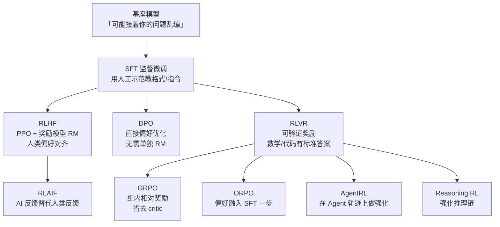

- **SFT（Supervised Fine-Tuning）**：用「指令-回答」示范数据微调，教模型按格式/指令作答。
- **RLHF（Reinforcement Learning from Human Feedback）**：训练一个**奖励模型 RM** 学习人类偏好，再用 **PPO** 强化学习让模型输出更高分回答。
- **DPO（Direct Preference Optimization）**：绕开单独训练 RM 与 PPO，直接在「偏好对（更优/更劣）」上优化，更简洁稳定。
- **RLAIF**：用 AI 反馈替代人类反馈，降低标注成本。
- **RLVR（Reinforcement Learning with Verifiable Rewards）**：当答案**可验证**（数学有标准解、代码能跑通测试）时，用「对/错」作为奖励，比主观偏好更可靠。
- **GRPO**：组内样本相对打分，省去价值网络（critic），训练更高效，是 DeepSeek 等常用的强化变体。
- **ORPO**：把「偏好对齐」合并进 SFT 一步完成。
- **AgentRL / Reasoning RL**：在 Agent 执行轨迹 / 长链推理上做强化学习。

> **记忆法（用户原创）**：SFT＝「照着标准答案抄」；RLHF＝「请老师打分再改」；DPO＝「直接告诉你 A 比 B 好，你往 A 靠」；RLVR＝「做有标准答案的题，对了给糖」。
> **叠加顺序**：实际工业界常把 SFT → RLHF/DPO → RLVR/AgentRL 串起来用，并非互斥。

### 2.3 基座模型「接着编」的问题

预训练底座只是「续写机器」，你问它问题，它可能**顺着问题继续编下去**（幻觉/不跟随指令）。这正是对齐（SFT/RLHF/推理强化）要解决的：把「续写」改造成「听懂指令、基于事实作答」。

### 2.4 Scaling Law 与评测

- **Scaling Law**：模型性能随参数量、数据量、算力平滑提升的经验律。可先在小火上做实验拟合曲线，再外推大模型该投多少资源。
- **评测（如何搭评测集 / 怎么评）**：
  1. 选基准（见下）；
  2. 构造/清洗题目集（含领域专属题，如旅游管理文献题）；
  3. 用 **lm-eval-harness** 跑分，对比不同对齐策略；
  4. 关注「能力边界」而非单点分数。
- **国际主流 LLM 评测标准**：MMLU（知识）、HumanEval / MBPP（代码）、SWE-bench（真实工程修复）、ARC-AGI（抽象推理）、GPQA（研究生级科学），以及第三方综合榜单。分数受版本、提示、采样、工具和污染影响，不能脱离测试设置横比。

### 2.5 微调一个大模型的流程

数据准备 → Tokenizer 对齐 → 继续预训练（可选）→ **SFT** → **DPO/RLHF** → **RLVR**（可验证任务）→ 评测 → 迭代。

### 2.6 预训练 后训练 微调与对齐的边界

这四个词不是同一层级：

- **预训练**：从大量通用数据学习语言、知识和基础能力，产出基座模型。
- **后训练**：预训练之后所有面向“可用性”的训练总称，可包含 SFT、偏好优化、安全对齐、推理强化、工具使用训练等。
- **微调**：用较小数据继续更新全部或部分参数的技术动作。它既可以做领域适配，也可以服务于对齐。
- **对齐**：让模型行为符合人类意图、偏好、安全规范或可验证目标，是目标；SFT、DPO、RLHF 等是手段。

常见但并非唯一的顺序是：

```text
数据治理 → 预训练 → 继续预训练 可选 → SFT → 偏好或安全对齐 → 推理或工具强化 → 评测与部署
```

没有规定“必须先 RM 再所有微调”。只有采用典型 RLHF 管线时，才需要先收集偏好数据、训练 Reward Model，再用 PPO 一类算法优化策略模型。DPO、ORPO、KTO 等路线可以不训练独立 RM。

### 2.7 PPO DPO ORPO KTO GRPO 到底差在哪

| 方法 | 训练信号 | 是否通常需要独立 RM | 核心用途与直觉 |
|---|---|---:|---|
| **PPO** | 奖励值 + 策略梯度 | 不一定；RLHF 中通常需要 | 在限制模型别偏离太远的同时，提高期望奖励 |
| **RLHF** | 人类偏好 | 是，经典路线需要 | 完整流程，不是一个单独优化器；PPO 只是其中常见一环 |
| **DPO** | chosen/rejected 偏好对 | 否 | 直接提高优选回答相对劣选回答的概率 |
| **ORPO** | SFT 数据 + 偏好对 | 否 | 把监督学习与偏好约束合并到一个目标中 |
| **KTO** | 单条回答的好/坏标签 | 否 | 不要求严格成对偏好，更适合只有二元反馈的数据 |
| **GRPO** | 同一问题多份答案的组内相对奖励 | 通常不需要单独 critic | 用组内基线降低成本，常用于可验证推理训练 |
| **RLVR** | 规则、执行器或标准答案给出的可验证奖励 | 否 | 数学、代码、游戏或工具任务中“答案可判定” |

对话里出现的“PO”容易混淆：它可能只是 Preference Optimization（偏好优化）的泛称，也可能是某篇方法名的缩写；没有上下文时不要把它当成与 PPO/DPO 同等明确的标准算法。

**会不会同时用？** 会，但通常是分阶段而不是同一批次全部叠加。例如 SFT 打底，DPO 调偏好，再对可验证推理做 GRPO/RLVR；是否值得叠加要靠消融实验决定。

### 2.8 Reward Model 监督学习与强化学习

- **监督学习**有“目标答案或标签”，直接比较预测和标签，计算 loss 后反向传播。SFT 属于监督学习。
- **强化学习**面对状态、动作、奖励，优化长期累计奖励。模型不一定收到唯一标准答案，而是收到结果好坏。
- **奖励模型 RM**把“提示词 + 回答”映射成一个分数。经典训练数据是人类排序，但也可以来自规则、AI 评审、专家评分、用户反馈或可验证执行结果。
- **RLAIF**用 AI 反馈替代或补充人工偏好；它降低成本，但可能把评审模型的偏见放大，因此仍需人工校验。
- **RLHF 不是 PPO**。RLHF 描述“反馈来源和训练流程”；PPO 是可用于优化策略的算法。可以近似记成“经典 RLHF = 偏好数据 + RM + PPO + KL 约束”，但这不是唯一实现。

### 2.9 全参数微调 LoRA PEFT 与模型蒸馏

- **全参数微调**：更新模型全部权重，容量最大，但显存、训练时间和每任务存储成本高。
- **PEFT（Parameter-Efficient Fine-Tuning）**：参数高效微调的总称，只训练很小一部分参数。LoRA、Adapter、Prompt Tuning 都属于 PEFT。
- **LoRA**：冻结原权重 `W`，只学习一个低秩增量 `ΔW = B × A`。如果原矩阵是 `d×k`，可让 `A` 为 `r×k`、`B` 为 `d×r`，且 `r` 很小，于是训练参数从 `d×k` 降为 `r×(d+k)`。
- **为什么小矩阵能起作用**：领域适配需要的权重变化往往集中在低维方向；LoRA 不需要重写整张“大地图”，只学习一组关键修正。是否足够仍取决于任务、数据、rank 和目标层，需要评测。
- **可插拔/可合并**：同一基座可加载不同 LoRA adapter；推理时也可把 `ΔW` 合并进 `W`。小文件保存的是“变化量”，不是完整模型，所以单独拿 LoRA 文件无法运行。
- **QLoRA**：把基座量化以省显存，同时训练 LoRA；它适合资源受限的微调，不等于把最终模型质量自动提高。
- **模型蒸馏**：让学生模型学习教师模型输出、概率分布或推理轨迹。合法性与质量取决于数据授权、服务条款、输出许可和是否侵犯商业秘密；“国内模型都在蒸馏国外模型”是无法一概而论的推断。

### 2.10 Loss 优化器与训练稳定性

- **损失函数（Loss）**：把预测错误压成一个可优化的数。因果语言模型常用交叉熵；loss 越低表示对训练分布中的下一个 token 预测越准，但不等于真实世界表现一定更好。
- **反向传播**：用微积分链式法则求每个参数对 loss 的梯度。
- **AdamW**：按参数历史梯度自适应调整步长，并把权重衰减与梯度更新解耦，是 Transformer 训练常用优化器。
- **Warmup**：开局逐渐增大学习率，避免随机初始化或新训练阶段被大步更新打崩。
- **Decay / Cooldown**：中后期逐步降低学习率，让模型更细致收敛。
- **梯度裁剪**：当梯度过大时限制其范数，降低训练突然发散的风险。
- **FP16 / BF16 混合精度**：用低精度加速矩阵计算、节省显存，并在关键环节保留较高精度。BF16 动态范围更大，通常更稳；硬件需支持。

### 2.11 多卡并行与显存优化

| 技术 | 拆什么 | 适合场景 | 主要代价 |
|---|---|---|---|
| 数据并行 DP/DDP | 不同卡处理不同样本 | 模型能装进单卡 | 每步同步梯度 |
| 张量并行 TP | 一层里的大矩阵 | 单层太大装不下 | 卡间通信频繁 |
| 流水线并行 PP | 不同层放不同卡 | 层数多、模型很大 | 流水气泡与调度复杂 |
| 模型并行 | 泛指把模型拆到多卡 | 单卡装不下 | 通信和实现复杂 |
| ZeRO/FSDP | 参数、梯度、优化器状态分片 | 训练大模型 | gather/scatter 通信 |
| 梯度检查点 | 少存中间激活，反向时重算 | 显存紧张 | 以计算换显存 |

多卡不一定线性加速。要同时测吞吐量、每 token 延迟、峰值显存、通信占比和扩展效率；如果模型很小，通信开销可能抵消多卡收益。

---

## 模块三 · Agent 体系

### 3.1 Agent 的完整定义

> **Agent = LLM（大脑） + Harness（执行运行时/调度框架） + MCP（工具协议） + Skill（技能 SOP） + Memory（记忆）**

用户经典追问「Agent 不就是能自主决策吗，要 Harness 干嘛？」——**LLM 只负责「想」，Harness 负责「做」**：把 LLM 的意图变成真实世界的动作、并管理失败重试与多步状态。

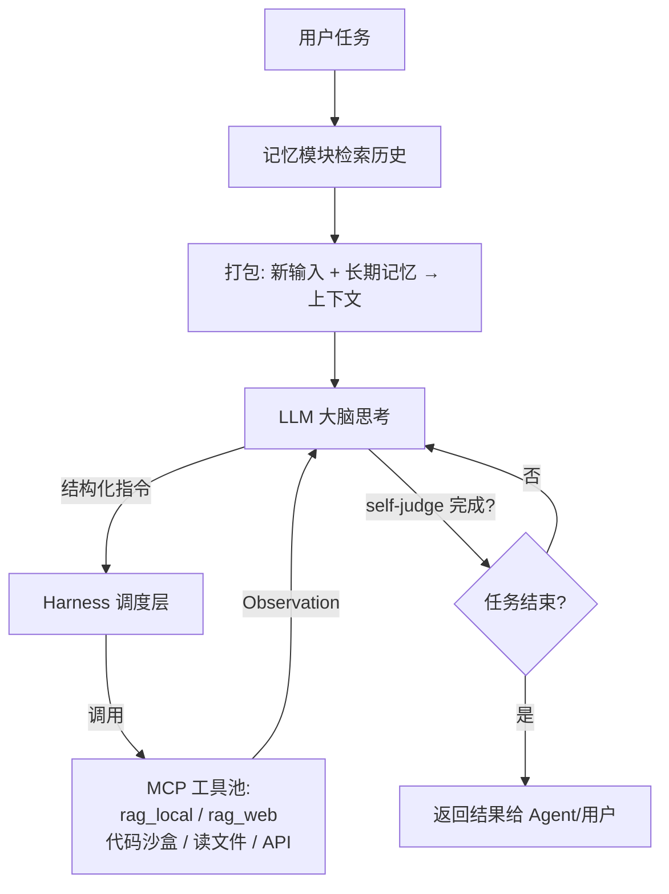

### 3.2 Harness（执行运行时）=「项目经理」

Harness 负责：任务拆解、状态跟踪、错误重试、子 Agent 调度、把 LLM 的结构化指令翻译成工具调用。类比**项目经理**——模型是「首席架构师」，Harness 带着团队把蓝图落地。

- **从 0→1 写一个 Harness** 要考虑：任务队列、上下文窗口管理、工具注册与超时、重试与回滚、子 Agent 派发、安全沙箱、可观测日志。
- **DeepSeek-Harness vs WorkBuddy**：前者是**开源底盘**（可自行组装、改造成自家产品）；后者是**闭源成品**（开箱即用的工作 Agent）。自行组装的优势：开发者/企业可深度定制、控成本、嵌私有数据，不被单一供应商锁定。

### 3.3 MCP（模型上下文协议）=「AI 世界的 USB-C」

MCP 是标准化「模型 ↔ 工具/数据源」的通用接口，让任意模型都能即插即用地调用文件、数据库、API、代码沙盒。类比 USB-C：统一接口，免去为每个工具单独适配。

- 用户确认句「harness 通过 MCP 调用各类工具完成 Agent 指令，比如写代码就让写代码的 Agent 在沙箱运行」——**正确**。
- **Webhook** = 一种「事件到来时自动回调通知」的 HTTP 机制（如工具执行完主动推结果）；**大模型路由** = 把不同任务分发给不同模型/工具的调度逻辑（如简单问答走小模型、编码走 Codex）。

### 3.4 ReAct 循环

**ReAct = Reason（推理）+ Act（行动）**，是 Agent 最小循环范式：

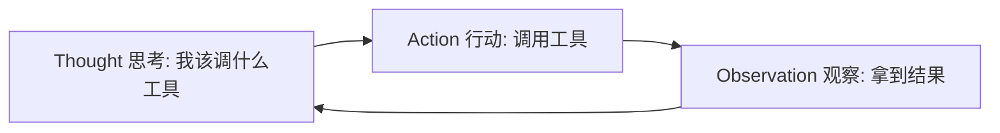

- ReAct 发生在 **LLM 思考→产出指令**这一环；其产物（Action/Observation）直接交给 Harness 执行。
- 用户问「ReAct 运行结果会直接传至 Harness 吗？」——是的，LLM 输出 Action，Harness 执行并回填 Observation，再 Loop。
- **Harness 的本质**：是一段**代码**（调度运行时），不只是「配置」。

### 3.5 RAG（检索增强生成）

RAG 让模型在回答前先「查资料」，缓解幻觉、注入私有/最新知识。

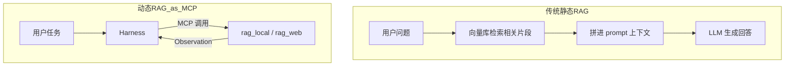

- **本地向量库 RAG**：把文档切块→向量化→存库，检索最相近片段拼进上下文。
- **Web 联网 RAG**：没有本地库时，Harness 直接通过 MCP 调 `rag_web` 去网上检索——此时 RAG 不再是「前置拼接」，而是 **Agent 链路里的一个工具**（动态 RAG）。
- **RAG 与模型参数如何协作（保继刚 2022《XX 旅游》论文案例）**：模型参数提供「通用学术常识与方法论」，RAG 提供「论文原文片段与具体结论」，两者在 prompt 中结合，模型据此生成有出处的回答；若问题超出参数记忆或需要最新/私有内容，RAG 补位。
- **RAG 也会幻觉**：检索到错误/无关片段、切块割裂语义、或模型过度依赖少量片段而忽略全局时，仍可能答错。所以 RAG 是「减幻觉」而非「免幻觉」。
- **大模型如何据 RAG 拼接上下文生成**：把检索片段作为证据文本放进 prompt，模型在生成时「以证据为准」组织答案（类似开卷考试）。
- **组织答案的信息源头在 prompt 中**：是的——最终答案所依据的「材料」主要来自 prompt（含 RAG 注入），模型参数是「理解/组织能力」的来源。

### 3.6 Skill vs Plugin

- **Skill（技能）**：在许多 Agent 产品里表示一套可复用的任务方法、提示、检查清单、模板和脚本；有的以 Markdown 为入口，有的由平台以其他格式定义。它不必然是代码，也不保证跨平台通用。
- **Plugin（插件）**：可安装的扩展包，可能包含技能说明、可执行工具、连接器、UI 或权限声明。
- **Tool（工具）**：一次可调用的具体能力，如搜索、读文件、运行代码或发请求。
- **MCP Server**：通过 MCP 暴露工具、资源或提示模板的服务端。一个插件可以打包 MCP Server，也可以完全不用 MCP。
- 因此没有全行业唯一公式；使用某个平台时应以该平台定义为准。

### 3.7 编排框架：LangChain / LangGraph / AutoGen / ReAct

- **LangChain / LangGraph**：把 LLM、工具、记忆、检索「编排」起来的开发框架，降低搭 Agent 的门槛。
- **AutoGen**：微软的多 Agent 对话协作框架。
- **没有 LangChain 还能工作吗？** 能。LangChain 只是「胶水」，本质是你自己写循环：调 LLM → 解析输出 → 调工具 → 回填 → 再调 LLM。**ReAct、Plugin、Tool 不依赖 LangChain 也能组合**，框架只是让工程更省事。

### 3.8 记忆检索与上下文

- **记忆（Memory）**：长期沉淀的用户偏好、历史任务、领域知识，按需检索。
- **上下文（Context）**：当前这次推理真正「喂给模型」的文本窗口 = 新输入 + 检索到的记忆 + 工具结果等。
- **为什么先记忆检索再上下文？** 为了**把最相关的历史/知识精准塞进有限的上下文窗口**，既减少无关噪声，也**降低幻觉**（让模型有依据）。
- 本质：用户任务 → 先查记忆 → 再组上下文 → 模型思考，这套前置正是为了减少模型「凭空编」。

### 3.9 新一代模型会怎样改进 Agent 链路

对话中用“GPT-6 Astra 对比 GPT-5 系列”来追问模型为什么快速迭代。具体型号、内部架构、上下文长度、价格和安全百分比都属于时效信息；如果官方没有发布技术报告，就不能把营销名或推测写成事实。更稳妥的比较框架是：

1. **基座能力**：推理、编码、多模态、长上下文是否提升；
2. **工具能力**：函数调用参数是否更准，能否并行调用，失败后能否修正；
3. **长程可靠性**：多步任务的完成率、状态保持、恢复能力；
4. **效率**：首 token 延迟、每秒 token、价格、上下文缓存；
5. **安全与控制**：权限边界、提示注入防护、审计日志、人类确认；
6. **评测证据**：公开基准、真实业务回归集和可复现实验，而非只看发布会结论。

模型迭代快，通常来自数据治理、训练配方、合成数据、推理时计算、蒸馏、基础设施优化和产品反馈共同形成的飞轮，不意味着每次都从零训练。

### 3.10 KV-Cache（小学生版）

大模型生成文字像“一节一节接龙”。如果没有缓存，每生成一个新 token，都要重新计算全部历史 token 的 K/V。**KV Cache 把每一层、每个历史 token 的 K 和 V 张量存起来**；生成下一个 token 时只计算新 token 的 Q/K/V，再让新 Q 读取历史 K/V。

KV Cache 的真实形态是多维浮点或量化张量，不是文字草稿，也不是模型“理解后的中文总结”。其典型维度与 `层数 × batch × KV头数 × 序列长度 × 每头维度 × K/V两份` 有关。上下文越长、并发越高，它越占显存。它通常放在加速器显存中以保证速度，但工程上也可以分层、分页、量化或卸载到 CPU 内存，代价是延迟增加，所以“只能放显存”并不绝对。

**推理时 KV 会变化吗？** 会。每生成一个 token，就追加该 token 在每层的 K/V；历史部分通常不变，新部分持续增长。滑动窗口或上下文截断时，旧部分可能被淘汰。

### 3.11 Prompt Cache 与 KV Cache 必须分开

| 概念 | 作用范围 | 缓存内容 | 典型命中条件 | 主要收益 |
|---|---|---|---|---|
| KV Cache | 同一次生成请求内部，也可由服务端会话机制延续 | 每层历史 token 的 K/V 张量 | 当前生成继续沿用相同前缀 | 降低每个输出 token 的重复计算 |
| Prompt/Prefix Cache | API 产品层，可跨请求复用 | 固定前缀经预填充后的中间状态或等价缓存 | 新请求前缀与已缓存前缀完全匹配到规定长度 | 降低重复输入的预填充成本和延迟 |
| 应用缓存 | 业务层 | 完整响应或检索结果 | 请求键相同或语义相近 | 直接复用结果，甚至不调用模型 |

“跨 API 请求复用”就是：第一次请求包含一大段固定系统提示或相同文档，服务商计算后暂存；第二次独立 HTTP 请求仍以完全相同前缀开头，就可以从缓存继续，而不必重算这段前缀。是否自动启用、最小长度、保留时间和价格由服务商规则决定。

**缓存命中不只发生在不同聊天轮次**：只要 API 的前缀缓存机制允许，两个独立请求也可能命中；同一请求内逐 token 生成则是 KV Cache，不应叫“缓存输入计费命中”。

**为什么输出 token 通常更贵？** 输入 prompt 的 prefill 可以把许多 token 并行处理；输出必须自回归，一个 token 接一个 token 地执行完整模型，并占用服务时间和 KV Cache。它不是因为“每次把历史文字重新读一遍”——KV Cache 正是在避免重算历史 K/V——而是因为每个新 token 仍要经过所有层、读取不断增长的缓存并完成一次解码。API 账单里的 cached input、uncached input 和 output 通常是不同计费项，输出不会因为读取 KV Cache 自动变成“缓存输入价”。

### 3.12 上下文工程

Prompt Engineering 关注“这一条提示怎么写”；**Context Engineering** 关注“模型在这一时刻应该看见哪些信息、按什么顺序、以什么格式、何时更新”。实现通常包括：

1. 系统规则和角色边界；
2. 当前用户任务与结构化状态；
3. 从长期记忆检索出的少量相关信息；
4. RAG 证据及其来源；
5. 工具定义、参数 schema 和权限；
6. 最近的工具 Observation；
7. 示例、输出格式和停止条件；
8. 压缩、摘要、去重、截断和 token 预算。

关键指标包括任务成功率、证据利用率、上下文相关率、提示注入抵抗力、token 成本和延迟。上下文越长不必然越好：无关信息会稀释注意力，头尾位置效应可能让中间内容被忽略。

### 3.13 Tree of Thought 与 self judge

- **Chain of Thought**：沿一条候选推理路径前进。
- **Tree of Thought**：生成多个候选分支，评估后保留更有希望的路径；更像搜索算法，成本也更高。
- **self-judge / self-reflection**：模型或独立评审器根据验收标准检查结果，必要时重试。它不保证正确，因为“生成者”和“评审者”可能共享盲点。
- **可验证环境**：优先用单元测试、编译器、数学验证器、规则引擎、网页状态或业务断言判定结果；能用外部验证时，不应只靠模型自评。

### 3.14 其他概念速记

- **OpenClaw vs ChatGPT Computer Use**：都是「让模型操作电脑界面」的能力；Computer Use 是 ChatGPT 原生的屏幕操作；OpenClaw 类是开源/第三方的同类方案。
- **Hugging Face**：全球最大的开源模型/数据集/工具社区（「AI 的 GitHub」）。
- **模型/工具/上下文/记忆/任务执行** 的关系：输入文本 → 记忆检索 → 进上下文 → LLM 思考 → Harness 调工具 → 结果回上下文 → 循环。LLM 是「脑」，Harness 是「手脚」，两者是两步而非一步（脑决策、手脚执行）。
- **ChatGPT 是 Agent 还是 LLM？** 它既是 LLM（底座），也通过工具/Computer Use 构成了 Agent 能力——是「带 Agent 外壳的 LLM」。
- **豆包答案突然 `**` 加粗**：Markdown 加粗语法被前端渲染成富文本，属输出格式控制，与回答内容正确性无关。

### 3.15 WorkBuddy 走红的产品机制

对话把 WorkBuddy 的走红归因于“从聊天变成交付”。更系统地看，是几层共同作用：

1. **任务价值**：用户得到文件、表格、报告或执行结果，而不只是文字建议；
2. **门槛**：桌面端、模板/技能市场和自然语言入口降低了搭 Agent 的配置成本；
3. **运行时**：Harness 把模型、文件、浏览器、代码和重试串成可持续多步任务；
4. **分发与时机**：AI 办公需求、竞品教育和真实案例传播形成窗口；
5. **生态**：办公软件、IM、云服务或企业权限集成决定能否进入日常流程；
6. **信任**：本地文件权限、沙箱、确认机制、可撤销性和日志决定用户是否敢让它做事。

“别的 Agent 没火”不能只归因于技术弱。产品成熟度、渠道、品牌、定价、场景聚焦、稳定性和发布时间都可能更关键。SkillHub 的数量也不直接等于质量，应看模板成功率、维护状态、权限透明度和用户复用率。

---

## 模块四 · 算力与硬件

### 4.1 算力 / 显存 / 带宽 三大件

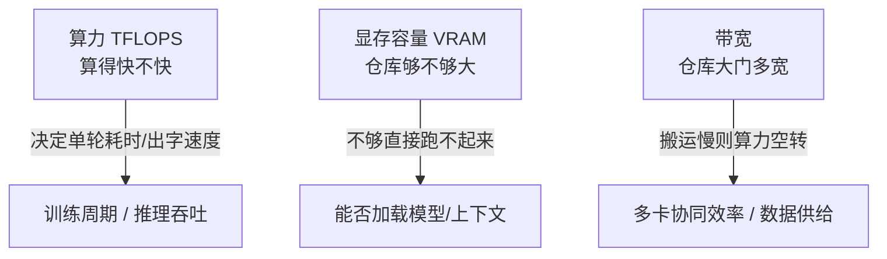

- **算力（TFLOPS）**：每秒浮点运算次数 → 决定完成一次计算/每秒出多少 token。
- **显存（VRAM）**：存放权重、梯度、优化器状态、中间激活、**KV-Cache**。显存不够直接跑不起来——是大模型第一大瓶颈。
- **带宽**：显存带宽（GPU 核心↔显存）+ 多卡互联带宽（NVLink / InfiniBand / NCCL）。带宽低，GPU 空等数据，算力浪费。

### 4.2 芯片如何训练大模型

1. 文本切段送入 GPU 集群；
2. **前向计算**：读权重算输出，对比答案得误差；
3. **反向传播**：据误差算每个参数该调大/调小（梯度）；
4. **优化器更新**：用梯度改几十亿/万亿参数；
5. 循环亿万次缩小误差；
6. **分布式**：模型并行（参数分片）+ 数据并行（不同 batch）+ 高速互联同步梯度。

> 训练阶段显存 ≫ 推理：还要存梯度、优化器状态、每步激活。如 175B 的 GPT-3 全套训练态需 TB 级显存，单卡放不下。

### 4.3 为什么放显存跑？能不能放内存？

- GPU 读**显存**速度是读主机**内存**的几十~上百倍。模型每秒反复读几十 GB 权重，放内存条会因搬运慢而暴跌几十倍。
- **技术可行但仅适合测试**：叫 offload（内存卸载），临时搬进显存，PCIe 慢、延迟高、并发易卡死，不适合线上。
- **本质**：在显存里跑 = 让计算核心能「随手取用」权重与 KV-Cache，最大化吞吐。

### 4.4 训练到使用的硬件旅程

数据采集/清洗（CPU+硬盘）→ 预训练（万卡 GPU 集群，吃算力+显存+互联带宽）→ 对齐（同集群）→ 部署推理（单/多 GPU，吃显存与带宽）→ 用户端（App/浏览器，消费级 GPU 或 Mac 统一内存）。

### 4.5 CUDA 生态（详细展开）

NVIDIA 的 CUDA 是「让软件指挥 GPU 干活」的平台，关键库：

- **cuBLAS**：线性代数（矩阵乘法）加速库，Transformer 的核心算力来源；
- **cuDNN**：深度神经网络原语（卷积、归一化、激活）优化；
- **NCCL**（NVIDIA Collective Communications Library）：多卡/多机**集合通信**库，负责梯度同步、参数广播，是分布式训练的「神经网络」。

> 这也是为何大模型训练高度依赖 NVIDIA：CUDA 生态成熟、库齐全，对手（AMD ROCm 等）追赶中。

### 4.6 Ollama 与本地推理

- **Ollama**：在本地跑开源 LLM 的工具，默认加载 **GGUF** 格式，提供 `http://localhost:11434` 的 API。
- 例：`ollama run qwen3.5:4b` 即可本地起一个 4B 多模态模型。

### 4.7 Windows 显存 vs macOS 统一内存

- **Windows 独显方案**：独立 GPU 带自有 **VRAM**（如 RTX 5070Ti 16GB），模型权重放 VRAM。
- **macOS Apple Silicon**：**统一内存（Unified Memory）**——CPU 与 GPU 共享同一块物理内存，无「显存/内存」之分。对应关系是：Mac 的「统一内存容量」≈ Windows 的「显存 + 部分内存」。

### 4.8 Mac 单核/多核、P 核/E 核、RTX 与常见显卡

- **单核性能**：一个核心能跑多快（影响单线程/低并发）；**多核**：多个核心并行（影响吞吐）。
- **P 核（性能核）**：高功耗高性能，干重活；**E 核（能效核）**：低功耗，处理后台/轻任务。Apple Silicon 同时有 P/E 核。
- **RTX 系列**：NVIDIA 消费级游戏/创作显卡（如 RTX 4070/5070/5090），也能跑本地 LLM。
- **常见显卡**：NVIDIA RTX 40/50 系、数据中心 H100/H800/A100/A800、Apple M 系、AMD RX 系等。

### 4.9 RTX 5070Ti / 5090 与 Mac 对标

- **RTX 5090**：当前消费级旗舰，显存大（约 32GB）、算力强，适合跑大模型与训练小规模实验；**价格高昂**（约万元级）。
- **RTX 5070Ti**：中高端，约 16GB 显存，性价比之选，适合 7B~14B 量化模型流畅推理；**价格约数千元**。
- **Mac 能否对标？** MacBook/Mac Studio 用统一内存（如 M5 Max 128GB、M5 Ultra 更高），**内存容量可超 RTX 显存**，适合跑更大参数模型（靠容量），但**绝对算力/带宽通常不及 5090**（靠 GPU 设计）。即：Mac 胜在「能装下大模型」，RTX 胜在「算得快」。

### 4.10 大厂用什么训练？

国内互联网企业训练大模型用 **Linux + A800/H800（NVIDIA 中国特供版）集群**，**不用 Windows、不用 Mac**——需要万卡级分布式、NVLink 互联、稳定 Linux 服务器环境，消费级设备不满足。

### 4.11 Mac M5 32G 能跑训练吗？

- 跑**推理/微调小模型**可行；跑 0.1B 从零训练也可（小模型），但**无多卡、靠 FlexAttention 替代 Triton**（Apple 生态无 Triton，用 FlexAttention 写高效注意力）。
- 旅游管理文献改造：把 PDF/双栏文献 OCR 提取 → 外挂 SSD 存语料 → 在 Mac 上做小规模领域预训练/继续训练可行，但「工业级」训练不行。

### 4.12 Ollama `qwen3.5:4b` 解析

该网址指向 Ollama 上的 Qwen3.5-4B 模型卡，涉及：

- **多模态**：4B 级别支持图文输入；
- **Gated DeltaNet**：一种新型序列建模架构（线性注意力/状态空间类），相比纯 Transformer 在长上下文更省算力——属于前沿架构探索。

---

## 模块五 · 大模型生态

### 5.1 大模型家族总览（思维导图）

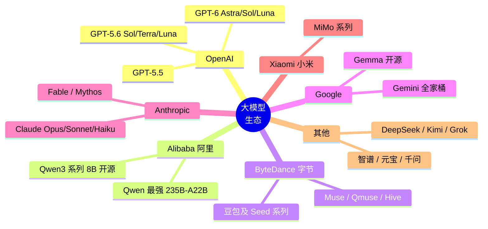

### 5.2 GPT 家族：5.5 / 5.6 / 6

对话使用 5.5、5.6、6、Astra、Sol、Luna 等名称比较代际。型号命名可能来自特定产品入口，并不自动等于公开 API 型号；“Symphony 架构、固定上下文长度、提升百分比、价格减半”等若无官方技术报告支持，不应当作确定事实。

正确比较两个代际，应固定同一任务集、系统提示、工具、温度、预算与运行次数，至少观察：

1. **准确性**：事实、数学、代码、指令遵循；
2. **Agent 能力**：工具选择、参数正确率、长程完成率、失败恢复；
3. **多模态**：图片、音频、视频和文档理解；
4. **效率**：首 token 延迟、吞吐、输入/缓存/输出价格；
5. **上下文**：标称长度之外，还要测长文定位和中间信息利用；
6. **安全性**：越权、提示注入、数据泄漏和人类确认机制。

### 5.3 垂类 vs 通用模型

- **通用模型**（GPT/豆包/DeepSeek）：啥都能聊，但缺行业深度与私有数据。
- **垂类模型**（如美团「问小团」、携程酒旅大模型）：= **基座 + 私有知识库 + 交易 API + Agent**。优势是行业精准、可直连业务（订酒店/推线路）；劣势是泛化弱、维护成本高、依赖基座能力。
- **美团「问小团」**：属**垂类大模型**（酒旅场景），并非通用模型。

### 5.4 开放权重（Open Weight）改变四种成本

用户原问「为什么芯片/云厂商/应用公司支持开放权重」——核心逻辑是**不想让模型层独占全部利润**：

| 成本         | 封闭 API       | 开放权重                 |
| ---------- | ------------ | -------------------- |
| **调用成本**   | 永远按次付费给单一供应商 | 可自部署，不被 API 次数绑定     |
| **迁移成本**   | 难以改模型        | 可按自身环境修改             |
| **数据治理成本** | 敏感数据出域       | 数据可留本地               |
| **竞争成本**   | 供应商垂直整合      | 芯片/云/应用/开发者围绕同一模型抢客户 |

> 反过来，领先模型公司强调安全、质量、持续服务以维持集中部署。芯片/云/应用公司支持开放权重，是因为**模型越易得，对算力、部署、微调、安全、行业应用的需求越大，价值向其他环节扩散**。

### 5.5 产业链：芯片 / 云厂商 / 第三方服务商

- **芯片企业**（NVIDIA/AMD/华为昇腾）：提供算力硬件，是「发动机」。
- **云厂商**（阿里云/腾讯云/火山引擎）：建好机房堆 GPU，按需出租算力——**租机器的房东**（还提供现成大模型 API）。叫「云」是因为算力像水电一样隔着网络按需取用。
- **第三方服务商**（vLLM/LangChain 类）：不造机器、不建机房，只做软件工具把模型改造成业务系统——**装修队/家具商**。
- **三者在产业链的意义**：芯片造算力 → 云厂商出租算力 → 第三方把算力变成可用 AI 产品。例：美团买火山引擎 GPU（云），用 LangChain（第三方）做酒旅 Agent。

### 5.6 豆包的商业化

- **为什么从免费走向付费**：推理算力、训练研发、内容审核和带宽都产生持续成本；付费还能区分轻度与重度用户、保障高峰容量、验证专业能力的商业价值。
- **是否由集团其他业务补贴**：大型平台常在新业务早期进行战略投入，但资金来源和内部核算只有财报、公司披露或可靠报道才能确认，不能从“免费”直接推导出“由某个具体业务养活”。
- **是否已经盈利**：产品有付费功能不等于业务整体盈利。需区分订阅收入、API 收入、获客补贴、折旧、研发与算力成本；若公司未单独披露，就应标注“无法从公开信息确定”。

### 5.7 小米 MiMo 系列

- 属**通用大模型**（非纯垂类），但与豆包/DeepSeek 定位、数据、对齐各有侧重。
- 小米自研目的：补齐 AI 底座、赋能「人车家」生态（手机/汽车/家居）、掌握核心技术不依赖外部。
- 在 AA Index 等榜单有亮相，体现国产通用模型竞争力。

### 5.8 各家通用模型擅长（速查）

- **DeepSeek**：推理/代码强、性价比高、开源；
- **ChatGPT / GPT-6**：通用最强、Agent/多模态/编码标杆；
- **豆包 Seed**：中文、内容创作、字节生态；
- **Kimi**：超长上下文、文档处理；
- **Grok**：实时信息（接 X）、推理；
- **Gemini**：多模态、长上下文、谷歌生态；
- **Cursor / Codex**：代码专用 Agent；
- **千问 Qwen**：开源生态、中文、多尺寸；
- **元宝**：腾讯系、社交/内容；
- **智谱 GLM**：国产通用、政务/企业。

### 5.9 具体模型科普

- **Qwen3-8B**：Qwen3 系列的 8B 稠密开放权重模型，官方发布说明列为 Apache 2.0；适合中文、通用任务和本地实验。“系列最好”没有绝对答案，大模型通常更强但也更贵。
- **Qwen3.5 在 Ollama**：标签如 `qwen3.5:4b` 表示模型家族与规模；同一标签还可能有不同量化。Ollama 官方模型页列出 0.8B、2B、4B、9B、27B 等多个尺寸及文件体积，运行内存还需给 KV Cache、运行时和上下文留余量。
- **豆包**：面向用户的产品可能按任务路由不同模型。若官方没有披露当前会话所用模型与参数量，不能仅凭产品名断言固定 B 数。
- **Gemini**：型号会持续变化，常用命名维度包括 Pro/Flash/Flash-Lite，以及语音、图像、Embedding、Computer Use 等专用模型；以 Google 官方 Models 目录为准。Gemma 是 Google 的开放模型家族，但不等同于 Gemini API 型号。
- **Claude**：Anthropic 使用 Opus、Sonnet、Haiku，以及新代际出现的 Fable/Mythos 等命名。`Opus` 是 Anthropic/Claude 家族中的型号名；具体活跃型号和退役日期以官方模型生命周期页为准。

---

## 模块六 · AI 产品经理视角

### 6.1 AI 产品经理的 AI 知识占比

基于全部对话内容，可以判断你已能主动追问模型原理、训练、Agent、RAG、缓存、算力与生态，明显超出只会写 Prompt 的入门阶段；但“掌握 45%”没有统一量表，不应伪装成精确测量。面向 AI 产品经理岗位，仍需补充：

- 模型选型与成本测算（按 token/按部署）；
- 数据闭环与标注体系设计；
- 评测指标与上线监控（幻觉率、满意度）；
- 隐私合规与算力预算；
- Agent 产品交互设计（human-in-the-loop）；
- 商用协议与供应链风险。

### 6.2 AI 产品评测与标注（大厂语境）

- **评测**：建基准集（功能/安全/对齐/业务指标），自动化跑分 + 人工抽检，持续回归。
- **标注**：构建「指令-偏好/事实-标注」数据，用于 SFT/RLHF；大厂有专业标注团队与质检流程，分采集、标注、审核、入库环节。

### 6.3 Muse / Qmuse / Hive（字节系）

这些名称在不同公司、项目或内部语境中可能重名。学习时不要只凭名称推断归属和能力，应先确认产品官网、开发者文档与实际入口。若它们指内容创作/生产力产品，其潜在优势通常来自内容、剪辑、协作、分发等生态集成；是否优于 ChatGPT 或 WorkBuddy 必须按具体任务、可用工具、价格、权限与完成率实测。

### 6.4 工程与组织概念

- **轻量化模型**：量化/蒸馏/小参数模型，适合端侧/低成本部署。
- **端到端**：运营、产品、研发围绕同一目标闭环，减少交接损耗。
- **DevRel（开发者关系）**：连接公司与开发者社区，推动 API/工具 adoption。
- **Side Project**：业余独立项目，是锻炼与验证想法的低成本方式。
- **能力边界**：当前通用模型在强推理、长程执行、实时事实、物理操作上仍有上限，产品需明确边界与兜底。

### 6.5 9 家互联网公司面试素材

基于对话整理的可用于面试的素材：腾讯（混元/微信生态）、阿里（通义/电商云）、字节（豆包/Seed/火山）、小红书（种草/多模态）、快手（短视频/推荐）、百度（文心/搜索）、滴滴（出行/调度）、美团（问小团/本地生活）、得物（潮流电商/社区）。每家可谈「其 AI 战略 + 代表模型/产品 + 与你目标的关联」。

### 6.6 能否应对 AI 产品面试？

结合全部聊天内容：**具备中上水平的基础知识储备**，能讲清 Agent/对齐/算力/生态，但需在「成本测算、数据闭环、合规、真实项目经历」上补强，方能稳健应对。

### 6.7 「AI 味」为什么重？

模型输出常被模板化（总分总、过渡词、礼貌套话、并列排比），源于训练数据风格与对齐偏好。可通过明确语气/人称/结构约束、引入真实案例与个性表达来降低。

### 6.8 ChatGPT 如何操控软件/界面/爬取/截图？

靠 **Computer Use / 工具调用（MCP/API）**：看屏幕（视觉）、调用系统/浏览器自动化、执行代码、读写文件——本质是 Agent + 工具链，而非模型凭空操作。

### 6.9 豆包答案的加粗/引用/表情如何实现？

模型据系统提示与产品规范生成 **Markdown/结构化文本**（加粗、引用块、emoji），前端再渲染成富文本。这与用户输入指令无必然关系，是产品层的输出规范。

---

## 模块七 · 深度原理追问（集中九问）

> 《AI术语认知》第 28 个用户回合集中提出 9 组深度问题。以下与前文互补，提供速查入口。

1. **如何从零训练一个 Agent？** 先训/选型基座 → 写 Harness（任务拆解、工具注册、重试、沙箱）→ 接 MCP 工具池 → 设计记忆与上下文管理 → 用 RLVR/AgentRL 在对齐阶段强化执行 → 评测长程任务。
2. **国际主流 LLM 评测标准？** 见 §2.4（MMLU / HumanEval / SWE-bench / ARC-AGI / GPQA / AA Index 等）。
3. **模型为何迭代快？新一代模型比上一代改了什么？** 迭代快来自数据、训练配方、合成数据、推理时计算、基础设施和产品反馈的飞轮；具体型号应按官方技术报告与业务回归集比较，见 §3.9、§9.6。
4. **Transformer 与 Attention 关系？注意力本质？FFN 干啥？** 见 §1.3（Transformer 是架构，Attention 是其核心子层；注意力=按相关性聚合上下文；FFN=逐位置非线性变换消化信息）。
5. **预训练 vs 推理的 Q/K/V 异同？无 KV-Cache 为何有 QKV？** 见 §1.3/§1.4（都产生 QKV，因都用 Transformer 算注意力；预训练无 KV-Cache 是因整段并行算完，不需缓存历史）。
6. **豆包加粗/引用/表情如何实现？** 见 §6.9（Markdown + 前端渲染，产品输出规范）。
7. **为何算 QK 相似度？权重啥意思？V 怎关预测 token？** 见 §1.3（相似度=相关性权重；加权 V=融合上下文后的表示，直接送入下一层预测下一 token）。
8. **预训练 vs 推理过程区别？** 见 §1.4（训练=并行+反向+更新产权重；推理=自回归前向生成不更新）。
9. **没有 LangChain 能否让 LLM/ReAct/Plugin/Tool 协作？** 能。LangChain 是胶水，核心是「调 LLM→解析→调工具→回填→循环」的自写循环，见 §3.7。

---

## 模块八 · 从自然语言到 Agent 交付的完整链路

这一章把对话里散落的 Tokenizer、Embedding、Transformer、KV Cache、RAG、ReAct、Harness、MCP、Skill、Plugin、Memory、训练与对齐放回同一张地图。先区分两条时间线：**离线训练线**负责“造出和改进模型”，**在线推理线**负责“处理这一次用户任务”。

### 8.1 离线训练线


1. **数据治理**：明确许可，去除重复、乱码、隐私和有害内容，做好领域配比和数据血缘。
2. **Tokenizer**：把文本稳定映射成 token id；训练数据和推理必须使用兼容词表。
3. **预训练**：因果掩码下预测下一个 token，计算交叉熵，反向传播并更新参数。
4. **后训练**：让续写模型学会遵循指令、偏好、安全规范、推理和工具调用。
5. **评测**：同时看通用能力、领域任务、安全、鲁棒性、成本、延迟和真实完成率。
6. **部署**：选择精度、量化、并行、批处理、KV Cache 管理和服务路由。

### 8.2 在线单次问答线

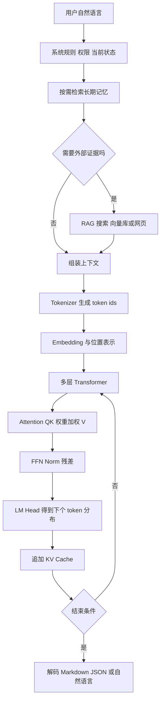

普通聊天并非必然先查记忆或 RAG。系统应先做**意图和新鲜度判断**：只有需要历史个性化、私有资料、最新事实或精确引用时才检索。无关记忆会增加成本并污染回答。

### 8.3 在线 Agent 执行线

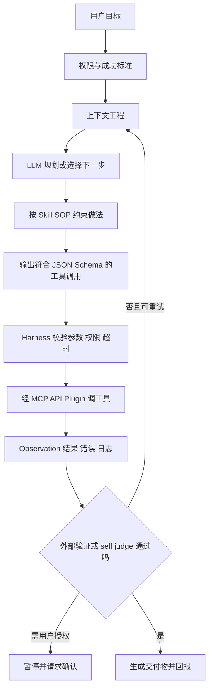

各概念的位置：

- **LLM**决定“下一步做什么”和“如何表达”；
- **Harness**保存状态、执行循环、处理错误与权限；
- **ReAct**是一种“思考—行动—观察”的控制模式；
- **Skill**是任务方法与规范，通常是文本，也可引用脚本和模板；
- **Plugin**是可安装的能力包，可能包含 Skill、工具和连接器；
- **MCP**是连接工具/资源的协议，不负责替模型思考；
- **RAG**既可在调用模型前检索，也可作为 Agent 在需要时调用的工具；
- **Memory**在多次任务之间持久化信息；**Context**是这一次真正送入模型的内容；
- **KV Cache**是模型计算缓存，既不是 Memory，也不是 RAG 数据库。

### 8.4 从零训练或构建 Agent 的可执行路线

严格说，多数团队不是“从零训练 Agent 基座”，而是选择现成 LLM，构建 Agent 系统；只有数据和算力充足时才做 SFT/AgentRL。

1. 写清目标、允许动作、禁止动作和完成判据；
2. 选模型并固定版本，定义成本与延迟预算；
3. 用 JSON Schema 定义工具，接入最少必要权限；
4. 实现 Harness 状态机、步数上限、超时、重试和幂等；
5. 增加 RAG、记忆、上下文压缩与引用；
6. 建可验证环境与回放日志；
7. 构造任务集：正常、边界、故障、恶意提示注入；
8. 先做 prompt/context 优化，再判断是否值得 SFT；
9. 有高质量执行轨迹时做 SFT，有可靠奖励时再做 RLVR/AgentRL；
10. 灰度发布，监控完成率、错误恢复、越权、成本和人工接管率。

### 8.5 0.1B 实验与 Mac 的现实边界

0.1B 教学模型适合学习 Tokenizer、Transformer、loss、训练循环和对齐，但不应期待达到商用聊天模型能力。Apple Silicon 可以用统一内存和 MPS/MLX 做小模型实验；Triton/CUDA kernel、多 NVIDIA GPU/NCCL 扩展测试则需要 NVIDIA 环境。MacBook Pro 32 GB 更适合：

- 训练很小的教学模型或短序列实验；
- 对 1B～数 B 模型做量化推理、LoRA/QLoRA 小规模实验；
- 开发和验证数据管线、Harness、RAG 与评测代码；
- 把大规模训练、多卡吞吐实验放到 Linux GPU 云或集群。

旅游领域语料必须解决版权、数据库许可、PDF 解析、引文去重和时间切分。中文核心或 SSCI 论文“能读到”不等于“可用于训练”；若目标只是准确问答，通常先做授权文献 RAG，比把论文直接预训练进参数更省资源、也更易给出处。

---

## 模块九 · 数据格式 工程控制 安全与上下文工程

### 9.1 Markdown JSON 与 JSON Schema

- **Markdown**是面向人阅读的轻量标记文本，`#` 表示标题，`**` 表示加粗，代码围栏表示代码块。它仍是纯文本，前端可渲染成富文本。
- **JSON**是机器交换数据的结构化文本，用对象、数组、字符串、数字、布尔值和 null 表达数据；它不允许随意注释，键名和字符串通常用双引号。
- **JSON 输出能力**是模型按 JSON 语法返回；**Structured Outputs / JSON Schema**进一步规定必填字段、类型、枚举和嵌套结构，便于 Harness 安全解析。

示例：

```json
{
  "name": "search_docs",
  "arguments": {
    "query": "KV Cache 与 Prompt Cache 的区别",
    "top_k": 5
  }
}
```

Schema 能保证结构，不保证事实正确。Harness 仍要做业务校验、权限校验和参数消毒。

### 9.2 状态机 循环控制器 异常捕获与死锁

- **状态机**：明确任务处于 `planning / waiting_tool / reviewing / completed / failed` 等状态，以及哪些转换合法。
- **循环控制器**：每轮调用模型或工具后决定继续、重试、换工具、请求用户还是结束。
- **异常捕获**：捕捉超时、网络错误、参数错误、权限拒绝、工具崩溃，转成可处理状态，而不是整个任务直接退出。
- **循环死锁**：Agent 一直重复相同步骤，状态没有进展。应设置最大步数、重复动作检测、总预算、超时和升级给人类的条件。
- **幂等**：重试同一操作不会重复扣款、重复发信或重复删除。对有副作用的工具尤其重要。

### 9.3 Agent 评测不是只用 RLHF 或 RLAIF

训练方法和评测方法不要混为一谈。Agent 评测通常包括：

| 层级 | 代表指标 |
|---|---|
| 模型层 | 知识、推理、代码、多模态、事实性 |
| 工具层 | 工具选择正确率、参数正确率、调用成功率 |
| 任务层 | 端到端完成率、步骤数、耗时、成本 |
| 恢复层 | 超时、网页变化、工具失败后的恢复率 |
| 安全层 | 越权率、提示注入成功率、敏感数据泄漏率 |
| 体验层 | 用户满意度、人工接管率、解释清晰度 |

自动验证器适合代码测试、文件 diff、数据库断言和网页状态；LLM-as-a-judge 适合开放文本，但要校准偏差并抽样人工复核。红队数据集故意包含越权、诱导泄密、提示注入、边界内容和资源耗尽攻击，用来发现系统在恶意条件下的失败方式。

### 9.4 Computer Use 外链访问与高风险行为

Computer Use 通常以截图/可访问性树为观察，以点击、键入、滚动等动作操作界面。浏览器或网站可能把自动化行为判为高风险，原因包括设备指纹、速度模式、登录地变化、反机器人策略或高风险操作本身。因此：

- 不要把“能看到界面”理解成“自动拥有权限”；
- 登录、支付、发帖、删除、上传敏感文件应要求人类确认；
- 站点可以限制自动化，验证码也不应绕过；
- 沙箱、域名白名单、最小权限和动作审计是关键防线。

某个 Gemini/ChatGPT/WorkBuddy 客户端能否打开外链，往往取决于该客户端是否启用了浏览工具、连接器权限、企业策略、地区与账户设置，而不是基座模型“智力不够”。同一品牌在不同产品入口的工具权限也可能不同。

### 9.5 AI 产品经理应掌握到什么程度

“懂 AI 百分之多少”没有客观统一刻度。与同龄人比较也取决于样本。更可执行的能力矩阵是：

1. 能向非技术同事解释模型、RAG、Agent、微调、缓存和成本；
2. 能把业务目标转成数据、Prompt/Context、工具和评测方案；
3. 能读 API 文档、JSON、日志和基本 Python/SQL；
4. 能设计离线评测与线上指标，知道何时人工兜底；
5. 能估算 token、GPU/API 成本与延迟；
6. 能识别隐私、版权、越权、提示注入和供应商锁定风险；
7. 至少完成一个可演示的端到端项目，并能解释失败与迭代。

计算机或软件工程专业通常会学编程、数据结构、操作系统、网络、数据库、机器学习基础，但不一定系统教授 RLHF、DPO、MCP、Agent Harness 等快速演进主题。这些更依赖选修课、论文、开源项目和实践。

### 9.6 时效信息的核验规则

模型名称、参数量、价格、上下文长度、许可证、显卡售价和产品能力都会变化。阅读本笔记中的生态章节时，应按以下顺序核验：官方模型页/技术报告 → 官方 API 文档与价格页 → 官方仓库模型卡 → 可信第三方实测。第三方排行榜是参考，不等同于业务效果；未公开参数量时不要用估算冒充官方数字。

本次校订参考的官方或一手资料包括：[Qwen3 发布说明](https://qwenlm.github.io/blog/qwen3/)、[Ollama Qwen3.5 模型页](https://ollama.com/library/qwen3.5)、[Google Gemini 模型目录](https://ai.google.dev/gemini-api/docs/models)、[Anthropic 模型生命周期](https://docs.anthropic.com/en/docs/about-claude/model-deprecations)、[Hugging Face PEFT LoRA 文档](https://huggingface.co/docs/peft/en/package_reference/lora)、[NVIDIA CUDA 编程指南](https://docs.nvidia.com/cuda/cuda-programming-guide/)与 [NCCL 文档](https://docs.nvidia.com/deeplearning/nccl/)。

---

## 问题覆盖索引

> 以下按 4 份原始文件逐回合编号，共 **109 个用户回合**。多个回合包含许多子问题；“章节”列可能指向多个位置。图片回合无法仅凭导出 JSON 完整复原视觉内容时，保留其相邻文字问答的主题映射，不虚构图片细节。

### 豆包·AI学习荟萃（24 问）

| #  | 用户提问                                                                                           | 章节             |
| -- | ---------------------------------------------------------------------------------------------- | -------------- |
| 1  | 旅游减贫学术文章评析（非 AI，略）                                                                             | —              |
| 2  | 大模型参数的表现形式                                                                                     | §1.1           |
| 3  | 美团/携程酒旅垂类 vs 通用优劣                                                                              | §5.3           |
| 4  | 开放权重四成本（芯片/云/应用为何支持）                                                                           | §5.4           |
| 5  | 芯片/云厂商/第三方作用；软硬件对大模型作用                                                                         | §5.5, §4.1     |
| 6  | 万亿参数需万卡；算力/显存/带宽；芯片训练；iOS/Windows 类比；训练本质；训练vs推理；云厂商区别；云意义；显存跑；上下文占显存；训练到使用硬件旅程；ChatGPT 训练部署发布 | §4.1–4.4, §1.4 |
| 7  | （图片）9 家公司分析                                                                                    | §6.5           |
| 8  | 按图分析 9 家互联网公司                                                                                  | §6.5           |
| 9  | harness 经 mcp 调工具（沙箱写代码）对否；webhook；大模型路由                                                       | §3.3, §3.1     |
| 10 | （图片）模型区别联系                                                                                     | §5.1           |
| 11 | 这些模型区别联系                                                                                       | §5.1–5.9       |
| 12 | GPT-6 为何强于 GPT-5，强在哪                                                                           | §5.2           |
| 13 | 豆包收费前是否亏损、靠抖音养                                                                                 | §5.6           |
| 14 | 豆包为何付费、是否盈利                                                                                    | §5.6           |
| 15 | Ollama `qwen3.5:4b` 知识点                                                                        | §4.12          |
| 16 | 8B 大模型                                                                                         | §5.9, §1.1     |
| 17 | Windows 显存 vs macOS 内存对应（显卡角度）                                                                 | §4.7           |
| 18 | Mac 单核/多核；RTX 是啥；常见显卡                                                                          | §4.8           |
| 19 | Ollama 是什么；Qwen 4B/9B/27B 最低显卡/统一内存；RTX5070Ti 适合啥 LLM                                          | §4.6, §4.8–4.9 |
| 20 | 目前最强 RTX 显卡                                                                                    | §4.8–4.9       |
| 21 | RTX5090/5070Ti 价格；Mac 有无组合追平                                                                   | §4.9           |
| 22 | 显卡物理体积；Mac Studio 能否追上                                                                         | §4.9           |
| 23 | 国内企业用 Windows 还是 Mac 训练                                                                        | §4.10          |
| 24 | 详细展开（CUDA）                                                                                     | §4.5           |

### AI术语认知（31 回合）

| # | 用户提问或主题 | 章节 |
|---:|---|---|
| 1 | 我已懂哪些 AI 术语 | 全文；§5.9 术语体系 |
| 2 | 将术语归类 | §0；模块一至九 |
| 3 | 最重要的术语与学习优先级 | §1.2–1.4；§2.1；§3.1–3.5 |
| 4 | AI 素养与同龄人比较 | §9.5 |
| 5 | 求职 AI 产品经理是否够用 | §6.1、§6.6、§9.5 |
| 6 | `Agent = LLM + Harness + Plugin + MCP + ReAct` 是否正确 | §3.1–3.7；§8.3 |
| 7 | LangChain 在哪里发挥作用 | §3.7 |
| 8 | LangChain 是否把一切组合起来 | §3.7；§8.3 |
| 9 | SFT、DPO、RLHF、LoRA 及其他类似技术 | §2.2、§2.7–2.9 |
| 10 | RLHF 目的、步骤；微调与对齐的含义和区别 | §2.1、§2.6、§2.8 |
| 11 | PPO、PO、DPO、ORPO、KTO | §2.7 |
| 12 | 预训练、后训练、微调、对齐的顺序；DPO 与 RLHF | §2.6–2.8 |
| 13 | RM 做什么；反馈来源；RLHF 与 PPO；LoRA/PEFT；监督学习与 RL | §2.7–2.9 |
| 14 | 微调技术、GRPO、BERT、Computer Use 风险、LoRA 两矩阵与插拔 | §1.10；§2.7–2.9；§9.4 |
| 15 | 计算机和软件工程专业是否会学这些 | §9.5 |
| 16 | Gemini 为什么不能访问外链 | §9.4 |
| 17 | Mac 应用、WorkBuddy、GitHub 在不同客户端的访问差异 | §9.4 |
| 18 | 缓存命中价格是什么 | §3.10–3.11 |
| 19 | 用通俗语言解释缓存 | §3.10–3.11 |
| 20 | 国内模型是否蒸馏 OpenAI、Anthropic、Google | §2.9 |
| 21 | KV Cache、输入输出 token 价格、缓存优惠 | §3.10–3.11 |
| 22 | 缓存命中是否跨轮；输出成本；KV 的真实形态 | §3.10–3.11 |
| 23 | 跨 API 复用；prefill/decode；KV 何时产生和变化 | §1.3；§3.10–3.11 |
| 24 | 输入、分词、向量、RAG、KV、Transformer、ReAct、训练的一条链 | §8.1–8.3 |
| 25 | 加上 Harness、Plugin、Skill、MCP、工具后的完整链路 | §8.3 |
| 26 | 是否已经最全面 | §8；§9；全文 |
| 27 | 极致完整版与 HTML 输出 | 全文；HTML 版 |
| 28 | 从零训 Agent、评测、模型迭代、Attention/QKV、产品渲染、推理差异、无框架编排等 9 问 | §1.3–1.4；§2.4；§3.7；§6.9；§7；§8.4 |
| 29 | JSON Schema、Harness 技术实现、红队评测、位置效应、普通/企业微调 | §2.9；§3.12；§9.1–9.4 |
| 30 | 残差/归一化/loss、并行/ZeRO/精度、优化器、Tokenizer、多模态、LoRA、因果掩码、QKV 纠偏 | §1.2–1.3；§1.8–1.10；§2.9–2.11 |
| 31 | 上下文工程如何实现 | §3.12 |

### 豆包·WorkBuddy走红原因（25 问）

| #  | 用户提问                                                                                                                                                                                                                                                                  | 章节                                                             |
| -- | --------------------------------------------------------------------------------------------------------------------------------------------------------------------------------------------------------------------------------------------------------------------- | -------------------------------------------------------------- |
| 1  | WorkBuddy 为何火                                                                                                                                                                                                                                                         | §3.2, §3.1                                                     |
| 2  | MCP/SkillHub 是什么；竞品为何没火                                                                                                                                                                                                                                               | §3.3, §3.6                                                     |
| 3  | Harness 是啥                                                                                                                                                                                                                                                            | §3.2                                                           |
| 4  | Agent 有 Harness 吗；DeepSeek-Harness 强在哪                                                                                                                                                                                                                                | §3.1, §3.2                                                     |
| 5  | DeepSeek-Harness 自行组装算啥优势                                                                                                                                                                                                                                             | §3.2                                                           |
| 6  | LangChain/AutoGen；GPT 系列差别；ReAct；预训练后训练；Agent 完整链路                                                                                                                                                                                                                    | §3.7, §5.2, §3.4, §2.1, §3.1                                   |
| 7  | 我已掌握 AI 知识占 PM 多少；还需补啥                                                                                                                                                                                                                                                | §6.1                                                           |
| 8  | AI 评测标注；MiMo 垂类/通用/目的；基座「接着编」；SFT/RLHF/推理强化；AgentRL；各家擅长；AA Index                                                                                                                                                                                                     | §6.2, §5.7, §2.3, §2.2, §5.8, §2.4                             |
| 9  | SFT/RLHF 记忆法；RLHF/AgentHF/ReasoningRL 同用？其他 RL？OpenClaw vs Computer Use；HuggingFace；模型/工具/上下文/记忆/任务关系；Muse/Qmuse/Hive；轻量化；端到端；DevRel；0→1 写 Harness；Side Project；能力边界；端云协同；Agent/Harness 区别；RAG 关联指标；Cowork/OpenCode/Copilot/Manus；LLM API/KV Cache/Agent Loop 等 16 概念 | §2.2, §2.7–2.9, §3.1–3.15, §6.3–6.4, §8.3 |
| 10 | 模型/工具/上下文/记忆/任务关系再理清；豆包 `**`；KV Cache 小学生版；自建 RAG 考虑 | §3.5, §3.8, §3.10–3.14 |
| 11 | Agent 运行链路逐步讲解                                                                                                                                                                                                                                                        | §3.1                                                           |
| 12 | 结合全部内容能否应对 AI 产品面试                                                                                                                                                                                                                                                    | §6.6                                                           |
| 13 | 为何「AI 味」重                                                                                                                                                                                                                                                             | §6.7                                                           |
| 14 | ChatGPT 操控软件/界面/爬取/截图靠啥                                                                                                                                                                                                                                               | §6.8                                                           |
| 15 | 记忆检索与上下文负责啥                                                                                                                                                                                                                                                           | §3.8                                                           |
| 16 | 为何先记忆检索再上下文                                                                                                                                                                                                                                                           | §3.8                                                           |
| 17 | Muse 相比 ChatGPT/WorkBuddy 优势；字节为何投国内版                                                                                                                                                                                                                                 | §6.3                                                           |
| 18 | SFT/PPO/DPO/GRPO 区别；微调流程；Tokenizer 重要性；SFT 与 Post-training 关系；DPO/RLHF/RLAIF 解决啥；LLM 与 NLP 关系                                                                                                                                                                         | §2.2, §2.5, §1.2, §2.1, §2.2, （NLP：LLM 是自然语言处理的主流技术，NLP 是更大学科） |
| 19 | 先查上下文记忆是否也为减幻觉                                                                                                                                                                                                                                                        | §3.8                                                           |
| 20 | （图片）                                                                                                                                                                                                                                                                  | —                                                              |
| 21 | 这个是啥                                                                                                                                                                                                                                                                  | —                                                              |
| 22 | RAG 整体思路                                                                                                                                                                                                                                                              | §3.5                                                           |
| 23 | 在 Agent 流程中 ReAct/RAG/MCP 各在哪些环节                                                                                                                                                                                                                                      | §3.4, §3.5, §3.3                                               |
| 24 | 模型如何据 RAG 拼接生成；RAG 也幻觉？ReAct 在 LLM 环节？Harness 本质是一串代码？                                                                                                                                                                                                                | §3.5, §3.4, §3.2                                               |
| 25 | LLM 组织答案的信息源头在 prompt 中？                                                                                                                                                                                                                                              | §3.5                                                           |

### 豆包·大模型训练全流程（29 问）

| #  | 用户提问                                    | 章节                                                 |
| -- | --------------------------------------- | -------------------------------------------------- |
| 1  | 0.1B 全流程任务如何完成                          | §1.5                                               |
| 2  | MacBook Pro M5 32G 1TB 能跑吗              | §4.11                                              |
| 3  | 需哪些软硬件；Codex/GPT5 额度与时间                 | §4.11, §1.5（成本和工期必须按当期价格、实验规模与实测吞吐估算） |
| 4  | 改在 Mac 训练旅游管理文献（南北核心+SSCI）需备啥           | §4.11                                              |
| 5  | 训练很费时吗                                  | §1.5（时间黑洞：预处理/训练/对齐各占大量时间）                         |
| 6  | 改用旅游相关资料呢                               | §4.11                                              |
| 7  | 只耗 90 万 token？Mac 受得了吗                  | §4.11                                              |
| 8  | 字节等公司怎么训练                               | §4.10, §4.2                                        |
| 9  | 把全部知识按学习路径整理通俗讲                         | 全文（尤其 §1.5 学习路径）                                   |
| 10 | 美团「问小团」属啥类型                             | §5.3                                               |
| 11 | WSL 是什么；如何搭评测集/评测；DeepSeek Harness 商业目的 | §2.4, §3.2（WSL=Windows 子系统跑 Linux，便于本地 GPU 训练）     |
| 12 | 上面答案多少来自 RAG、多少来自参数                     | §3.5（协作机制）                                         |
| 13 | 以保继刚 2022 论文为例讲 RAG 与参数协作               | §3.5                                               |
| 14 | 无本地向量库、RAG 直接联网检索逻辑                     | §3.5（Web-RAG）                                      |
| 15 | 传统流程 Rag 在 Agent 前，联网检索是否跳过             | §3.5（动态 RAG as MCP tool）                           |
| 16 | 即 Rag 变成 Harness 经 MCP 调用的工具            | §3.5                                               |
| 17 | 这些问题复杂吗                                 | （元问题，整体属中高级）                                       |
| 18 | Agent 运行流程（含 rag_local/rag_web 等工具池）    | §3.1                                               |
| 19 | GPT-6 Astra 在上述工作流改进                    | §3.9                                               |
| 20 | qwen3:8b 是怎样的大模型                        | §5.9                                               |
| 21 | 它是 Qwen 开源最好吗                           | §5.9                                               |
| 22 | 日常对话的豆包基本参数是多少 B                        | §5.9                                               |
| 23 | MIT 协议是啥                                | §1.7                                               |
| 24 | Gemini 有哪些大模型                           | §5.9                                               |
| 25 | Opus 是哪家的                               | §5.9                                               |
| 26 | Claude 系列分析                             | §5.9                                               |
| 27 | Fable 是哪家的                              | §5.9                                               |
| 28 | Skill 和 Plugin 差别                       | §3.6                                               |
| 29 | Skill 是代码吗                              | §3.6                                               |

---

*本笔记由 4 份真实聊天导出的 109 个用户回合体系化整理而成。可视化见对应 Mermaid 代码块；HTML 与 DOCX 版本提供可交互和可打印的同内容呈现。产品规格与价格会变化，请按 §9.6 的规则复核。*
