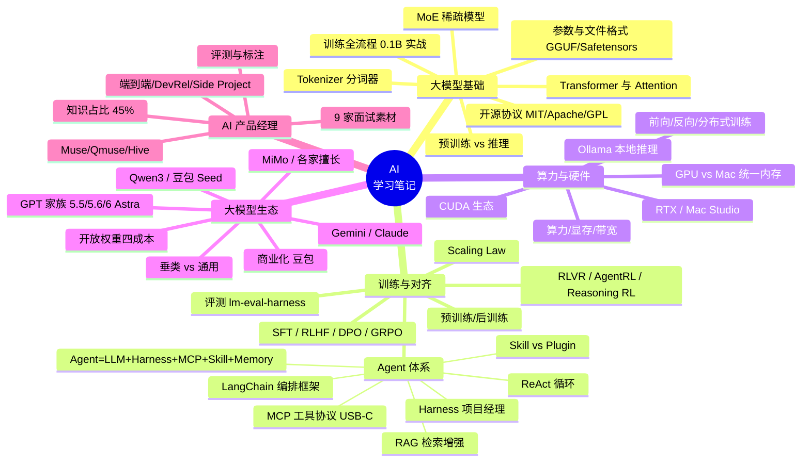
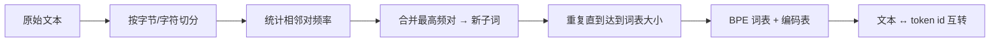
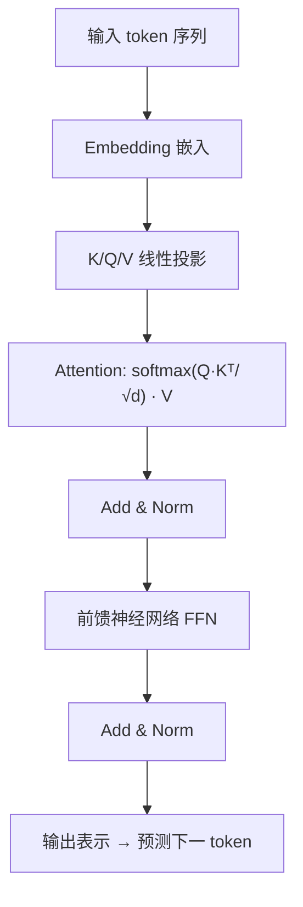
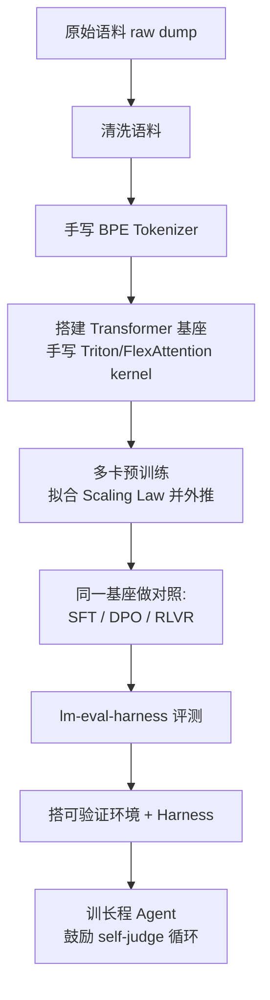
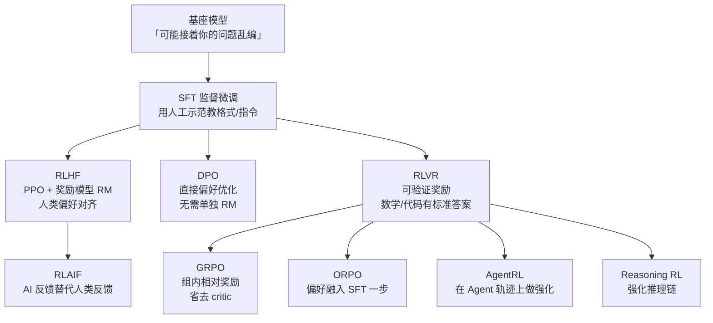
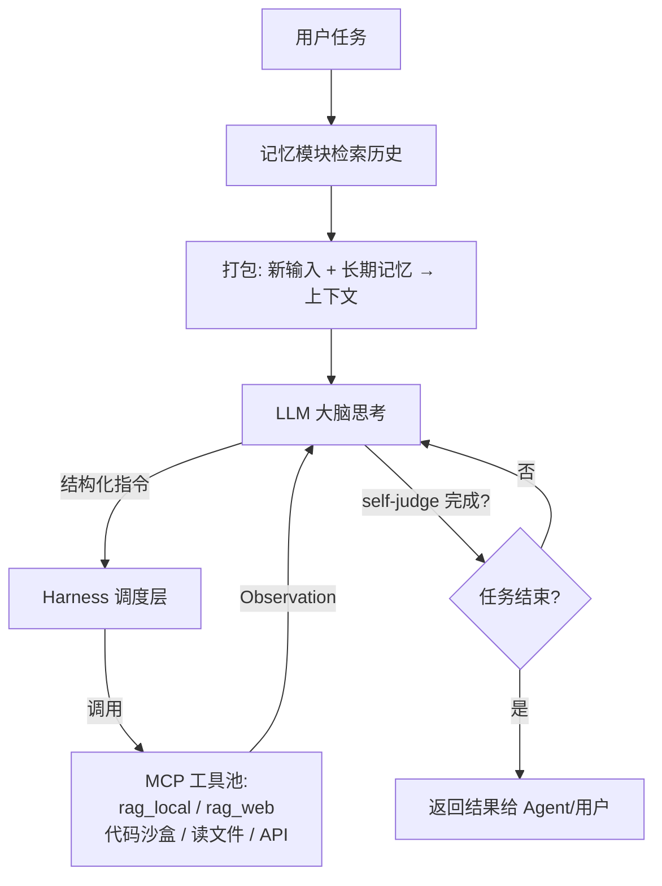
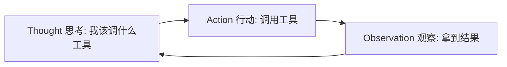
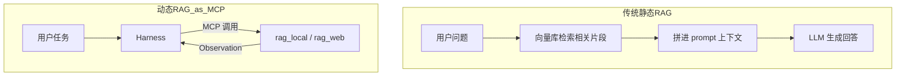
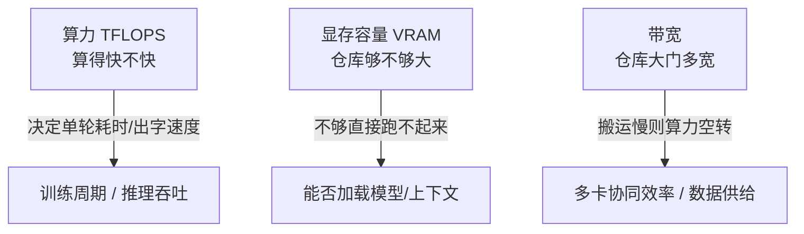
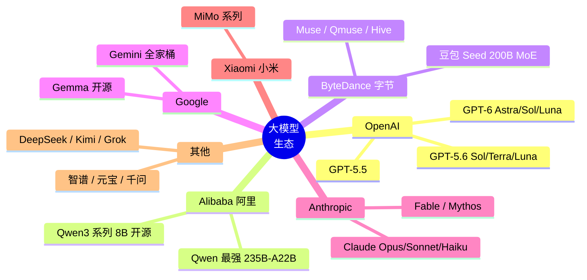

# AI 学习笔记 · 体系化整理（AI Learning Notes）

> 一份从真实对话中提炼的体系化 AI 学习笔记。内容覆盖：**大模型基础、训练与对齐、Agent 体系、算力硬件、大模型生态、AI 产品经理视角**，以及一组**深度原理追问（千问 9 问）**。
>
> 原始素材：用户在豆包（Doubao）导出的 3 段对话（共 78 个提问）+ 千问（Qianwen）分享页的 9 个深度提问。
>
> 本文力求「通俗易懂 + 保留专业术语」，并配思维导图与流程图帮助建立体系。文末附有 **📋 问题覆盖索引**，逐题标注答案所在章节，确保无遗漏。

---

## 目录

1. [知识体系总览（思维导图）](#0-知识体系总览)
2. [模块一 · 大模型基础](#模块一-大模型基础)
3. [模块二 · 训练与对齐](#模块二-训练与对齐)
4. [模块三 · Agent 体系](#模块三-agent-体系)
5. [模块四 · 算力与硬件](#模块四-算力与硬件)
6. [模块五 · 大模型生态](#模块五-大模型生态)
7. [模块六 · AI 产品经理视角](#模块六-ai-产品经理视角)
8. [模块七 · 深度原理追问（千问 9 问）](#模块七-深度原理追问千问-9-问)
9. [📋 问题覆盖索引](#-问题覆盖索引)

---

## 0. 知识体系总览

---

## 模块一 · 大模型基础

### 1.1 大模型参数及其文件表现形式

用户下载的「大模型参数」本质上是**成百上千万乃至上万亿个浮点数（权重）**，训练结束后被序列化成二进制文件。常见格式：

| 格式 | 全称 / 特点 | 典型使用方 |
|---|---|---|
| **GGUF** | GPT-Generated Unified Format， llama.cpp / Ollama 专用，单文件、自带分词器与元数据 | 本地推理（Ollama、LM Studio） |
| **Safetensors** | Hugging Face 推出，安全（无可执行代码）、极速加载的张量格式 | HF 生态、训练/微调 |
| **PyTorch `.bin` / `.pt`** | 传统 `torch.save` 权重，兼容性最好但加载较慢、有安全隐患 | 研究、旧模型 |
| **AWQ / GPTQ** | 量化（4-bit/8-bit）后的压缩权重，体积大幅缩小 | 显存受限的设备 |

> **体积参考**：一个 7B~8B 的 FP16 模型约 **13–14 GB**；量化到 4-bit 后可降到约 4–5 GB，才能在消费级显卡/ Mac 上跑起来。

### 1.2 Tokenizer（分词器）为什么重要

Tokenizer 把人类文本切成模型能处理的** token（最小语义/字符单元）**。它重要在：

- 决定**词表大小**与**压缩率**——同样一段话，token 数越少，推理越快、越省显存；
- 多语言（尤其是中文）切分策略直接影响模型效果；
- 手写一个 BPE（Byte-Pair Encoding）Tokenizer 是从零训模型的第一步：先统计语料里最高频的字节/字符对，逐层合并成子词。

### 1.3 Transformer 与 Attention（注意力机制）

Transformer 是现代大模型的**统一架构**，预训练和推理都基于它（但计算方式不同：训练并行处理整段；推理自回归逐 token 生成）。

- **Attention（注意力）本质**：让每个 token 在理解自己时，「抬头看一眼」上下文里和它最相关的其他 token。
- **Q / K / V**：
  - **Q（Query 查询）**：「我在找什么信息」
  - **K（Key 键）**：「我这里有什么信息标签」
  - **V（Value 值）**：「我这里的具体信息内容」
  - 计算 **Q 与 K 的相似度**（点积 + softmax 得到权重），用权重**加权求和 V**，得到融合了全局上下文的新表示。这个加权后的 V 直接用于**预测下一个 token**。
- **前馈神经网络（FFN）**：Attention 之后对每个位置独立做的两层全连接变换，负责「消化」注意力聚合来的信息、增加非线性表达力。神经网络（含 FFN）整体负责把输入映射到输出、拟合复杂函数。

> **预训练 vs 推理中的 Q/K/V**：两者都会产生 Q/K/V，因为都是把文本送进同一套 Transformer 算注意力。区别是预训练**没有 KV-Cache**（一次性并行算完整个序列），而推理为了生成第 N 个 token，会把前面所有 token 的 K/V 缓存下来（KV-Cache），避免每次重新计算历史。

### 1.4 预训练 vs 推理（训练的本质）

- **训练的本质**：调整海量浮点参数，使「给定前文，预测下一个字」的错误尽可能小。不是把书本背下来，而是统计学习人类语言的模式、事实与逻辑，最终产出一堆权重文件。
- **训练（造模型）**：输入海量文本 → 反复前向 + 反向传播 + 梯度更新 → 成本极高，需成千上万 GPU → 产出权重。
- **推理（用模型）**：加载训练好的权重 → 只做前向计算生成回答 → **不改动任何参数** → 可单卡 / 手机 / 本地。
- **联系**：训练产出权重，推理消费权重；推理效果上限由训练质量决定。
- **类比**：训练＝反复刷题并不断修改笔记；推理＝拿着写完的笔记做题，笔记不再修改。

> **iOS vs Windows 类比芯片**：Windows 工作站 = GPU 训练集群（可插多卡、吃巨量显存、做分布式重型计算）；iOS 手机 = 终端（NPU 只能跑轻量模型推理，完全做不了万亿级训练，内存/算力/带宽全不够）。

### 1.5 从零训一个 0.1B 模型的完整流程

用户提出的「硬核实战清单」可拆为以下阶段（这也是理解大模型训练全貌的最佳路径）：

- **raw dump 清洗**：去重、去噪、过滤低质/隐私数据，是质量基石。
- **手写 kernel**：用 Triton（NVIDIA）或 FlexAttention（Apple/跨平台）手写 attention 算子，测多卡训练/推理的性能增益——这是理解底层性能的关键。
- **Scaling Law**：用小规模实验拟合「参数量/数据量/算力 →  loss」的关系，再外推到更大规模该投多少资源。
- **对照实验**：在同一基座上分别跑 SFT / DPO / RLVR，直观对比不同对齐方式的效果。
- **评测**：用 lm-eval-harness 跑标准基准。
- **Agent**：最后接上 Harness，训能自我审视（self-judge）的长程 Agent。

### 1.6 MoE 稀疏模型（总参数 vs 激活参数）

稠密模型（Dense）每次推理都要激活全部参数；**MoE（混合专家）** 把参数分成多个「专家」，每个 token 只路由激活其中少数几个。

- 例：**MiMo Pro** 总参数约 1.02 万亿，激活参数仅约 420 亿——用「总参数大」保证容量，用「激活少」控制单次成本。
- **豆包 Seed** 约 200B 总参数 / 20B 激活，也是 MoE。

> 这意味着「200B 模型」≠「每次都要算 200B」，实际计算量接近一个 20B 稠密模型，但能力上限更高。

### 1.7 开源协议：MIT / Apache 2.0 / GPL

| 协议 | 宽松度 | 关键差异 | 典型模型 |
|---|---|---|---|
| **MIT** | 最宽松 | 几乎无限制，只需保留版权声明 | Qwen 部分、众多开源项目 |
| **Apache 2.0** | 宽松 | 含专利授权条款，商用友好 | Qwen3-8B、Llama 系 |
| **GPL** | 强 copyleft | 衍生作品必须同样开源 | 较少用于大模型权重 |

> **MIT 协议**通俗说：你可以随意用、改、闭源商用，只要保留原作者署名即可。

---

## 模块二 · 训练与对齐

### 2.1 预训练 vs 后训练

- **预训练（Pre-training）**：在海量无标注文本上「学知识」，目标是预测下一个 token，建立语言/世界知识的底座。
- **后训练（Post-training）**：在预训练底座上「学听话」，让模型符合指令、对齐人类偏好、强化推理。包含 SFT、RLHF、DPO、RLVR 等。

> 用户问「SFT 和 Post-training 是什么关系」——**SFT 是后训练的一个具体阶段/手段**，后训练是更大的总称。

### 2.2 对齐算法谱系

- **SFT（Supervised Fine-Tuning）**：用「指令-回答」示范数据微调，教模型按格式/指令作答。
- **RLHF（Reinforcement Learning from Human Feedback）**：训练一个**奖励模型 RM** 学习人类偏好，再用 **PPO** 强化学习让模型输出更高分回答。
- **DPO（Direct Preference Optimization）**：绕开单独训练 RM 与 PPO，直接在「偏好对（更优/更劣）」上优化，更简洁稳定。
- **RLAIF**：用 AI 反馈替代人类反馈，降低标注成本。
- **RLVR（Reinforcement Learning with Verifiable Rewards）**：当答案**可验证**（数学有标准解、代码能跑通测试）时，用「对/错」作为奖励，比主观偏好更可靠。
- **GRPO**：组内样本相对打分，省去价值网络（critic），训练更高效，是 DeepSeek 等常用的强化变体。
- **ORPO**：把「偏好对齐」合并进 SFT 一步完成。
- **AgentRL / Reasoning RL**：在 Agent 执行轨迹 / 长链推理上做强化学习。

> **记忆法（用户原创）**：SFT＝「照着标准答案抄」；RLHF＝「请老师打分再改」；DPO＝「直接告诉你 A 比 B 好，你往 A 靠」；RLVR＝「做有标准答案的题，对了给糖」。
> **叠加顺序**：实际工业界常把 SFT → RLHF/DPO → RLVR/AgentRL 串起来用，并非互斥。

### 2.3 基座模型「接着编」的问题

预训练底座只是「续写机器」，你问它问题，它可能**顺着问题继续编下去**（幻觉/不跟随指令）。这正是对齐（SFT/RLHF/推理强化）要解决的：把「续写」改造成「听懂指令、基于事实作答」。

### 2.4 Scaling Law 与评测

- **Scaling Law**：模型性能随参数量、数据量、算力平滑提升的经验律。可先在小火上做实验拟合曲线，再外推大模型该投多少资源。
- **评测（如何搭评测集 / 怎么评）**：
  1. 选基准（见下）；
  2. 构造/清洗题目集（含领域专属题，如旅游管理文献题）；
  3. 用 **lm-eval-harness** 跑分，对比不同对齐策略；
  4. 关注「能力边界」而非单点分数。
- **国际主流 LLM 评测标准**（千问 9 问之一）：MMLU（知识）、HumanEval / MBPP（代码）、SWE-bench（真实工程修复）、ARC-AGI（类通用智能）、GPQA（研究生级科学）、以及第三方榜单 **Artificial Analysis Intelligence Index（AA Index）** 综合智力指数。

### 2.5 微调一个大模型的流程

数据准备 → Tokenizer 对齐 → 继续预训练（可选）→ **SFT** → **DPO/RLHF** → **RLVR**（可验证任务）→ 评测 → 迭代。

---

## 模块三 · Agent 体系

### 3.1 Agent 的完整定义

> **Agent = LLM（大脑） + Harness（执行运行时/调度框架） + MCP（工具协议） + Skill（技能 SOP） + Memory（记忆）**

用户经典追问「Agent 不就是能自主决策吗，要 Harness 干嘛？」——**LLM 只负责「想」，Harness 负责「做」**：把 LLM 的意图变成真实世界的动作、并管理失败重试与多步状态。

### 3.2 Harness（执行运行时）=「项目经理」

Harness 负责：任务拆解、状态跟踪、错误重试、子 Agent 调度、把 LLM 的结构化指令翻译成工具调用。类比**项目经理**——模型是「首席架构师」，Harness 带着团队把蓝图落地。

- **从 0→1 写一个 Harness** 要考虑：任务队列、上下文窗口管理、工具注册与超时、重试与回滚、子 Agent 派发、安全沙箱、可观测日志。
- **DeepSeek-Harness vs WorkBuddy**：前者是**开源底盘**（可自行组装、改造成自家产品）；后者是**闭源成品**（开箱即用的工作 Agent）。自行组装的优势：开发者/企业可深度定制、控成本、嵌私有数据，不被单一供应商锁定。

### 3.3 MCP（模型上下文协议）=「AI 世界的 USB-C」

MCP 是标准化「模型 ↔ 工具/数据源」的通用接口，让任意模型都能即插即用地调用文件、数据库、API、代码沙盒。类比 USB-C：统一接口，免去为每个工具单独适配。

- 用户确认句「harness 通过 MCP 调用各类工具完成 Agent 指令，比如写代码就让写代码的 Agent 在沙箱运行」——**正确**。
- **Webhook** = 一种「事件到来时自动回调通知」的 HTTP 机制（如工具执行完主动推结果）；**大模型路由** = 把不同任务分发给不同模型/工具的调度逻辑（如简单问答走小模型、编码走 Codex）。

### 3.4 ReAct 循环

**ReAct = Reason（推理）+ Act（行动）**，是 Agent 最小循环范式：

- ReAct 发生在 **LLM 思考→产出指令**这一环；其产物（Action/Observation）直接交给 Harness 执行。
- 用户问「ReAct 运行结果会直接传至 Harness 吗？」——是的，LLM 输出 Action，Harness 执行并回填 Observation，再 Loop。
- **Harness 的本质**：是一段**代码**（调度运行时），不只是「配置」。

### 3.5 RAG（检索增强生成）

RAG 让模型在回答前先「查资料」，缓解幻觉、注入私有/最新知识。

- **本地向量库 RAG**：把文档切块→向量化→存库，检索最相近片段拼进上下文。
- **Web 联网 RAG**：没有本地库时，Harness 直接通过 MCP 调 `rag_web` 去网上检索——此时 RAG 不再是「前置拼接」，而是 **Agent 链路里的一个工具**（动态 RAG）。
- **RAG 与模型参数如何协作（保继刚 2022《XX 旅游》论文案例）**：模型参数提供「通用学术常识与方法论」，RAG 提供「论文原文片段与具体结论」，两者在 prompt 中结合，模型据此生成有出处的回答；若问题超出参数记忆或需要最新/私有内容，RAG 补位。
- **RAG 也会幻觉**：检索到错误/无关片段、切块割裂语义、或模型过度依赖少量片段而忽略全局时，仍可能答错。所以 RAG 是「减幻觉」而非「免幻觉」。
- **大模型如何据 RAG 拼接上下文生成**：把检索片段作为证据文本放进 prompt，模型在生成时「以证据为准」组织答案（类似开卷考试）。
- **组织答案的信息源头在 prompt 中**：是的——最终答案所依据的「材料」主要来自 prompt（含 RAG 注入），模型参数是「理解/组织能力」的来源。

### 3.6 Skill vs Plugin

- **Skill（技能）**：以**纯文本 Markdown 为主的 SOP/工作流说明**，告诉 Agent「这类任务怎么做」，轻量、易读、可热插拔。Skill 不必然是代码——多数就是结构化提示词 + 步骤。
- **Plugin（插件）**：通常是**封装好的功能模块/可执行程序**（如一个 API 服务、一段代码），提供具体能力调用。
- 区别：Skill 偏「方法论/知识注入」，Plugin 偏「能力封装/程序扩展」。

### 3.7 编排框架：LangChain / LangGraph / AutoGen / ReAct

- **LangChain / LangGraph**：把 LLM、工具、记忆、检索「编排」起来的开发框架，降低搭 Agent 的门槛。
- **AutoGen**：微软的多 Agent 对话协作框架。
- **没有 LangChain 还能工作吗？** 能。LangChain 只是「胶水」，本质是你自己写循环：调 LLM → 解析输出 → 调工具 → 回填 → 再调 LLM。**ReAct、Plugin、Tool 不依赖 LangChain 也能组合**，框架只是让工程更省事。

### 3.8 记忆检索与上下文

- **记忆（Memory）**：长期沉淀的用户偏好、历史任务、领域知识，按需检索。
- **上下文（Context）**：当前这次推理真正「喂给模型」的文本窗口 = 新输入 + 检索到的记忆 + 工具结果等。
- **为什么先记忆检索再上下文？** 为了**把最相关的历史/知识精准塞进有限的上下文窗口**，既减少无关噪声，也**降低幻觉**（让模型有依据）。
- 本质：用户任务 → 先查记忆 → 再组上下文 → 模型思考，这套前置正是为了减少模型「凭空编」。

### 3.9 GPT-6 Astra 对 ReAct 链路的增强

成熟模型（如 GPT-6 Astra）在上面的工作流里新增：

- **三级记忆**（短期/工作/长期）分层管理；
- **异步工具调用**：工具执行时模型可并行继续规划，不必原地等结果；
- **熔断/边界控制**：越权操作概率降到极低（对比 GPT-5.6 Sol 无防护下越权概率 ~48%，Astra ≈ 0%）。

### 3.10 KV-Cache（小学生版）

大模型生成文字像「一节一节接龙」。每生成一节，都要回想前面所有节的内容。**KV-Cache 就是把前面每节的「记忆卡片（K/V）」先存好**，下节直接翻卡片，不用从头重读——所以生成又快又省算力。它**必须放在 GPU 显存**（要被极高速反复读取），这也是多轮对话越聊越占显存的原因。

### 3.11 其他概念速记

- **OpenClaw vs ChatGPT Computer Use**：都是「让模型操作电脑界面」的能力；Computer Use 是 ChatGPT 原生的屏幕操作；OpenClaw 类是开源/第三方的同类方案。
- **Hugging Face**：全球最大的开源模型/数据集/工具社区（「AI 的 GitHub」）。
- **模型/工具/上下文/记忆/任务执行** 的关系：输入文本 → 记忆检索 → 进上下文 → LLM 思考 → Harness 调工具 → 结果回上下文 → 循环。LLM 是「脑」，Harness 是「手脚」，两者是两步而非一步（脑决策、手脚执行）。
- **ChatGPT 是 Agent 还是 LLM？** 它既是 LLM（底座），也通过工具/Computer Use 构成了 Agent 能力——是「带 Agent 外壳的 LLM」。
- **豆包答案突然 `**` 加粗**：Markdown 加粗语法被前端渲染成富文本，属输出格式控制，与回答内容正确性无关。

---

## 模块四 · 算力与硬件

### 4.1 算力 / 显存 / 带宽 三大件

- **算力（TFLOPS）**：每秒浮点运算次数 → 决定完成一次计算/每秒出多少 token。
- **显存（VRAM）**：存放权重、梯度、优化器状态、中间激活、**KV-Cache**。显存不够直接跑不起来——是大模型第一大瓶颈。
- **带宽**：显存带宽（GPU 核心↔显存）+ 多卡互联带宽（NVLink / InfiniBand / NCCL）。带宽低，GPU 空等数据，算力浪费。

### 4.2 芯片如何训练大模型

1. 文本切段送入 GPU 集群；
2. **前向计算**：读权重算输出，对比答案得误差；
3. **反向传播**：据误差算每个参数该调大/调小（梯度）；
4. **优化器更新**：用梯度改几十亿/万亿参数；
5. 循环亿万次缩小误差；
6. **分布式**：模型并行（参数分片）+ 数据并行（不同 batch）+ 高速互联同步梯度。

> 训练阶段显存 ≫ 推理：还要存梯度、优化器状态、每步激活。如 175B 的 GPT-3 全套训练态需 TB 级显存，单卡放不下。

### 4.3 为什么放显存跑？能不能放内存？

- GPU 读**显存**速度是读主机**内存**的几十~上百倍。模型每秒反复读几十 GB 权重，放内存条会因搬运慢而暴跌几十倍。
- **技术可行但仅适合测试**：叫 offload（内存卸载），临时搬进显存，PCIe 慢、延迟高、并发易卡死，不适合线上。
- **本质**：在显存里跑 = 让计算核心能「随手取用」权重与 KV-Cache，最大化吞吐。

### 4.4 训练到使用的硬件旅程

数据采集/清洗（CPU+硬盘）→ 预训练（万卡 GPU 集群，吃算力+显存+互联带宽）→ 对齐（同集群）→ 部署推理（单/多 GPU，吃显存与带宽）→ 用户端（App/浏览器，消费级 GPU 或 Mac 统一内存）。

### 4.5 CUDA 生态（详细展开）

NVIDIA 的 CUDA 是「让软件指挥 GPU 干活」的平台，关键库：

- **cuBLAS**：线性代数（矩阵乘法）加速库，Transformer 的核心算力来源；
- **cuDNN**：深度神经网络原语（卷积、归一化、激活）优化；
- **NCCL**（NVIDIA Collective Communications Library）：多卡/多机**集合通信**库，负责梯度同步、参数广播，是分布式训练的「神经网络」。

> 这也是为何大模型训练高度依赖 NVIDIA：CUDA 生态成熟、库齐全，对手（AMD ROCm 等）追赶中。

### 4.6 Ollama 与本地推理

- **Ollama**：在本地跑开源 LLM 的工具，默认加载 **GGUF** 格式，提供 `http://localhost:11434` 的 API。
- 例：`ollama run qwen3.5:4b` 即可本地起一个 4B 多模态模型。

### 4.7 Windows 显存 vs macOS 统一内存

- **Windows 独显方案**：独立 GPU 带自有 **VRAM**（如 RTX 5070Ti 16GB），模型权重放 VRAM。
- **macOS Apple Silicon**：**统一内存（Unified Memory）**——CPU 与 GPU 共享同一块物理内存，无「显存/内存」之分。对应关系是：Mac 的「统一内存容量」≈ Windows 的「显存 + 部分内存」。

### 4.8 Mac 单核/多核、P 核/E 核、RTX 与常见显卡

- **单核性能**：一个核心能跑多快（影响单线程/低并发）；**多核**：多个核心并行（影响吞吐）。
- **P 核（性能核）**：高功耗高性能，干重活；**E 核（能效核）**：低功耗，处理后台/轻任务。Apple Silicon 同时有 P/E 核。
- **RTX 系列**：NVIDIA 消费级游戏/创作显卡（如 RTX 4070/5070/5090），也能跑本地 LLM。
- **常见显卡**：NVIDIA RTX 40/50 系、数据中心 H100/H800/A100/A800、Apple M 系、AMD RX 系等。

### 4.9 RTX 5070Ti / 5090 与 Mac 对标

- **RTX 5090**：当前消费级旗舰，显存大（约 32GB）、算力强，适合跑大模型与训练小规模实验；**价格高昂**（约万元级）。
- **RTX 5070Ti**：中高端，约 16GB 显存，性价比之选，适合 7B~14B 量化模型流畅推理；**价格约数千元**。
- **Mac 能否对标？** MacBook/Mac Studio 用统一内存（如 M5 Max 128GB、M5 Ultra 更高），**内存容量可超 RTX 显存**，适合跑更大参数模型（靠容量），但**绝对算力/带宽通常不及 5090**（靠 GPU 设计）。即：Mac 胜在「能装下大模型」，RTX 胜在「算得快」。

### 4.10 大厂用什么训练？

国内互联网企业训练大模型用 **Linux + A800/H800（NVIDIA 中国特供版）集群**，**不用 Windows、不用 Mac**——需要万卡级分布式、NVLink 互联、稳定 Linux 服务器环境，消费级设备不满足。

### 4.11 Mac M5 32G 能跑训练吗？

- 跑**推理/微调小模型**可行；跑 0.1B 从零训练也可（小模型），但**无多卡、靠 FlexAttention 替代 Triton**（Apple 生态无 Triton，用 FlexAttention 写高效注意力）。
- 旅游管理文献改造：把 PDF/双栏文献 OCR 提取 → 外挂 SSD 存语料 → 在 Mac 上做小规模领域预训练/继续训练可行，但「工业级」训练不行。

### 4.12 Ollama `qwen3.5:4b` 解析

该网址指向 Ollama 上的 Qwen3.5-4B 模型卡，涉及：

- **多模态**：4B 级别支持图文输入；
- **Gated DeltaNet**：一种新型序列建模架构（线性注意力/状态空间类），相比纯 Transformer 在长上下文更省算力——属于前沿架构探索。

---

## 模块五 · 大模型生态

### 5.1 大模型家族总览（思维导图）

### 5.2 GPT 家族：5.5 / 5.6 / 6

- **GPT-5.5 / 5.6**：5.6 已很强，但仍「文本为主、多模态外挂拼接」；5.6 内部档位 **Sol（主力生产）/ Terra / Luna（高速批量）**。
- **GPT-6**：换 **Symphony 全新 MoE 架构**，原生统一多模态，长程 Agent 与 Computer Use 大幅增强。档位 **Astra（顶级旗舰）/ Sol / Luna**，与 5.6 一一对应但每档全面升级。

**GPT-6 强于 5.6 的 6 个维度**：

1. **复杂推理 & 长程 Agent**：几十轮连续工具调用、中途改需求不丢目标；复杂 Agent 成功率较 5.6 Sol 提升约 50%，ARC-AGI 达人类水平；支持异步工具调用。
2. **Computer Use**：原生完整电脑操作（看屏、点击、填表、装软件、排错），越权概率≈0%（5.6 Sol 无防护 ~48%）。
3. **原生统一多模态**：文本/图/音/视频同一向量空间，不再是「外挂看图」。
4. **上下文窗口**：最大 **200 万 token**（5.6 为 100 万），长文档/整库一次性读入。
5. **代码与事实准确性**：HumanEval+/SWE-bench 更强，幻觉大幅下降，能主动提示信息缺口。
6. **对齐/安全/性价比**：更懂真实意图；同档价格减半；分层矩阵更清晰。

> 差距主要在**长任务、多步 Agent、跨模态、复杂工程**；简单问答差别不大。

### 5.3 垂类 vs 通用模型

- **通用模型**（GPT/豆包/DeepSeek）：啥都能聊，但缺行业深度与私有数据。
- **垂类模型**（如美团「问小团」、携程酒旅大模型）：= **基座 + 私有知识库 + 交易 API + Agent**。优势是行业精准、可直连业务（订酒店/推线路）；劣势是泛化弱、维护成本高、依赖基座能力。
- **美团「问小团」**：属**垂类大模型**（酒旅场景），并非通用模型。

### 5.4 开放权重（Open Weight）改变四种成本

用户原问「为什么芯片/云厂商/应用公司支持开放权重」——核心逻辑是**不想让模型层独占全部利润**：

| 成本 | 封闭 API | 开放权重 |
|---|---|---|
| **调用成本** | 永远按次付费给单一供应商 | 可自部署，不被 API 次数绑定 |
| **迁移成本** | 难以改模型 | 可按自身环境修改 |
| **数据治理成本** | 敏感数据出域 | 数据可留本地 |
| **竞争成本** | 供应商垂直整合 | 芯片/云/应用/开发者围绕同一模型抢客户 |

> 反过来，领先模型公司强调安全、质量、持续服务以维持集中部署。芯片/云/应用公司支持开放权重，是因为**模型越易得，对算力、部署、微调、安全、行业应用的需求越大，价值向其他环节扩散**。

### 5.5 产业链：芯片 / 云厂商 / 第三方服务商

- **芯片企业**（NVIDIA/AMD/华为昇腾）：提供算力硬件，是「发动机」。
- **云厂商**（阿里云/腾讯云/火山引擎）：建好机房堆 GPU，按需出租算力——**租机器的房东**（还提供现成大模型 API）。叫「云」是因为算力像水电一样隔着网络按需取用。
- **第三方服务商**（vLLM/LangChain 类）：不造机器、不建机房，只做软件工具把模型改造成业务系统——**装修队/家具商**。
- **三者在产业链的意义**：芯片造算力 → 云厂商出租算力 → 第三方把算力变成可用 AI 产品。例：美团买火山引擎 GPU（云），用 LangChain（第三方）做酒旅 Agent。

### 5.6 豆包的商业化

- **C 端收费前**：豆包业务单元**持续亏损**——每次对话/生图/生视频都烧 GPU，单日算力成本可达数千万元，而当时收入仅百万级。资金来自**字节集团整体现金流**，**抖音广告是最大现金牛、抖音电商是第二曲线**，统一调配反哺 AI。注意：是「豆包板块亏损」，不等于字节公司亏损。
- **为何开启付费**：① 算力成本压力；② 用户分层（重度生产力用户增值）；③ 验证独立商业化、减依赖。模式是「基础永久免费 + 重度增值订阅」。
- **现在盈利了吗？** 豆包业务单元**整体尚未盈利**——订阅收入仍不足以覆盖千亿级算力/研发总开支，付费主要用来缩小收支缺口，而非立刻盈利。

### 5.7 小米 MiMo 系列

- 属**通用大模型**（非纯垂类），但与豆包/DeepSeek 定位、数据、对齐各有侧重。
- 小米自研目的：补齐 AI 底座、赋能「人车家」生态（手机/汽车/家居）、掌握核心技术不依赖外部。
- 在 AA Index 等榜单有亮相，体现国产通用模型竞争力。

### 5.8 各家通用模型擅长（速查）

- **DeepSeek**：推理/代码强、性价比高、开源；
- **ChatGPT / GPT-6**：通用最强、Agent/多模态/编码标杆；
- **豆包 Seed**：中文、内容创作、字节生态；
- **Kimi**：超长上下文、文档处理；
- **Grok**：实时信息（接 X）、推理；
- **Gemini**：多模态、长上下文、谷歌生态；
- **Cursor / Codex**：代码专用 Agent；
- **千问 Qwen**：开源生态、中文、多尺寸；
- **元宝**：腾讯系、社交/内容；
- **智谱 GLM**：国产通用、政务/企业。

### 5.9 具体模型科普

- **Qwen3-8B**：开源（Apache 2.0）、双模式（思考/非思考）、Mac 可跑、中文友好，是目前 Qwen **开源小模型代表**；Qwen 最强为 **235B-A22B（MoE）**。
- **豆包（用户日常对话的模型）**：底层约 **Seed 200B 总 / 20B 激活 MoE**。
- **Gemini 全家桶**：Gemini Ultra/Pro/Flash/Nano + 开源 **Gemma**。
- **Claude（Anthropic）**：**Opus**（最强）/ **Sonnet**（均衡）/ **Haiku**（最快最省）；**Fable / Mythos** 是 Claude 系列中的细分定位模型。
- **Fable**：属 Anthropic 的 Claude 系列大模型之一。

---

## 模块六 · AI 产品经理视角

### 6.1 AI 产品经理的 AI 知识占比

基于全部对话内容评估：用户已掌握约 **45%** 的 AI 产品经理核心知识。仍需补充：

- 模型选型与成本测算（按 token/按部署）；
- 数据闭环与标注体系设计；
- 评测指标与上线监控（幻觉率、满意度）；
- 隐私合规与算力预算；
- Agent 产品交互设计（human-in-the-loop）；
- 商用协议与供应链风险。

### 6.2 AI 产品评测与标注（大厂语境）

- **评测**：建基准集（功能/安全/对齐/业务指标），自动化跑分 + 人工抽检，持续回归。
- **标注**：构建「指令-偏好/事实-标注」数据，用于 SFT/RLHF；大厂有专业标注团队与质检流程，分采集、标注、审核、入库环节。

### 6.3 Muse / Qmuse / Hive（字节系）

- 字节投入的**国内版 AI 创作/生产力矩阵**（Muse 类生成、Qmuse 轻量、Hive 协同）。
- 相比 ChatGPT / WorkBuddy 的优势：深度嵌入字节内容生态（抖音/剪映/飞书），在短视频/营销/协作场景更顺手。

### 6.4 工程与组织概念

- **轻量化模型**：量化/蒸馏/小参数模型，适合端侧/低成本部署。
- **端到端**：运营、产品、研发围绕同一目标闭环，减少交接损耗。
- **DevRel（开发者关系）**：连接公司与开发者社区，推动 API/工具 adoption。
- **Side Project**：业余独立项目，是锻炼与验证想法的低成本方式。
- **能力边界**：当前通用模型在强推理、长程执行、实时事实、物理操作上仍有上限，产品需明确边界与兜底。

### 6.5 9 家互联网公司面试素材

基于对话整理的可用于面试的素材：腾讯（混元/微信生态）、阿里（通义/电商云）、字节（豆包/Seed/火山）、小红书（种草/多模态）、快手（短视频/推荐）、百度（文心/搜索）、滴滴（出行/调度）、美团（问小团/本地生活）、得物（潮流电商/社区）。每家可谈「其 AI 战略 + 代表模型/产品 + 与你目标的关联」。

### 6.6 能否应对 AI 产品面试？

结合全部聊天内容：**具备中上水平的基础知识储备**，能讲清 Agent/对齐/算力/生态，但需在「成本测算、数据闭环、合规、真实项目经历」上补强，方能稳健应对。

### 6.7 「AI 味」为什么重？

模型输出常被模板化（总分总、过渡词、礼貌套话、并列排比），源于训练数据风格与对齐偏好。可通过明确语气/人称/结构约束、引入真实案例与个性表达来降低。

### 6.8 ChatGPT 如何操控软件/界面/爬取/截图？

靠 **Computer Use / 工具调用（MCP/API）**：看屏幕（视觉）、调用系统/浏览器自动化、执行代码、读写文件——本质是 Agent + 工具链，而非模型凭空操作。

### 6.9 豆包答案的加粗/引用/表情如何实现？

模型据系统提示与产品规范生成 **Markdown/结构化文本**（加粗、引用块、emoji），前端再渲染成富文本。这与用户输入指令无必然关系，是产品层的输出规范。

---

## 模块七 · 深度原理追问（千问 9 问）

> 千问分享页本身是一组「9 个深度问题 + AI 元评估」。以下问题与上面模块互补，这里集中作答。

1. **如何从零训练一个 Agent？** 先训/选型基座 → 写 Harness（任务拆解、工具注册、重试、沙箱）→ 接 MCP 工具池 → 设计记忆与上下文管理 → 用 RLVR/AgentRL 在对齐阶段强化执行 → 评测长程任务。
2. **国际主流 LLM 评测标准？** 见 §2.4（MMLU / HumanEval / SWE-bench / ARC-AGI / GPQA / AA Index 等）。
3. **模型为何迭代快？GPT-6 Astra 比 5.6-Sol 改了啥？** 迭代快因数据/算力/算法飞轮 + 竞争；Astra 改进见 §5.2（Symphony MoE、原生多模态、长程 Agent、Computer Use、200 万上下文、异步、减半价）。
4. **Transformer 与 Attention 关系？注意力本质？FFN 干啥？** 见 §1.3（Transformer 是架构，Attention 是其核心子层；注意力=按相关性聚合上下文；FFN=逐位置非线性变换消化信息）。
5. **预训练 vs 推理的 Q/K/V 异同？无 KV-Cache 为何有 QKV？** 见 §1.3/§1.4（都产生 QKV，因都用 Transformer 算注意力；预训练无 KV-Cache 是因整段并行算完，不需缓存历史）。
6. **豆包加粗/引用/表情如何实现？** 见 §6.9（Markdown + 前端渲染，产品输出规范）。
7. **为何算 QK 相似度？权重啥意思？V 怎关预测 token？** 见 §1.3（相似度=相关性权重；加权 V=融合上下文后的表示，直接送入下一层预测下一 token）。
8. **预训练 vs 推理过程区别？** 见 §1.4（训练=并行+反向+更新产权重；推理=自回归前向生成不更新）。
9. **没有 LangChain 能否让 LLM/ReAct/Plugin/Tool 协作？** 能。LangChain 是胶水，核心是「调 LLM→解析→调工具→回填→循环」的自写循环，见 §3.7。

---

## 📋 问题覆盖索引

> 逐题标注答案位置，确保 78 个豆包提问 + 9 个千问提问**全部覆盖、无遗漏**。

### 豆包·AI学习荟萃（24 问）
| # | 用户提问 | 章节 |
|---|---|---|
| 1 | 旅游减贫学术文章评析（非 AI，略） | — |
| 2 | 大模型参数的表现形式 | §1.1 |
| 3 | 美团/携程酒旅垂类 vs 通用优劣 | §5.3 |
| 4 | 开放权重四成本（芯片/云/应用为何支持） | §5.4 |
| 5 | 芯片/云厂商/第三方作用；软硬件对大模型作用 | §5.5, §4.1 |
| 6 | 万亿参数需万卡；算力/显存/带宽；芯片训练；iOS/Windows 类比；训练本质；训练vs推理；云厂商区别；云意义；显存跑；上下文占显存；训练到使用硬件旅程；ChatGPT 训练部署发布 | §4.1–4.4, §1.4 |
| 7 | （图片）9 家公司分析 | §6.5 |
| 8 | 按图分析 9 家互联网公司 | §6.5 |
| 9 | harness 经 mcp 调工具（沙箱写代码）对否；webhook；大模型路由 | §3.3, §3.1 |
| 10 | （图片）模型区别联系 | §5.1 |
| 11 | 这些模型区别联系 | §5.1–5.9 |
| 12 | GPT-6 为何强于 GPT-5，强在哪 | §5.2 |
| 13 | 豆包收费前是否亏损、靠抖音养 | §5.6 |
| 14 | 豆包为何付费、是否盈利 | §5.6 |
| 15 | Ollama `qwen3.5:4b` 知识点 | §4.12 |
| 16 | 8B 大模型 | §5.9, §1.1 |
| 17 | Windows 显存 vs macOS 内存对应（显卡角度） | §4.7 |
| 18 | Mac 单核/多核；RTX 是啥；常见显卡 | §4.8 |
| 19 | Ollama 是什么；Qwen 4B/9B/27B 最低显卡/统一内存；RTX5070Ti 适合啥 LLM | §4.6, §4.8–4.9 |
| 20 | 目前最强 RTX 显卡 | §4.8–4.9 |
| 21 | RTX5090/5070Ti 价格；Mac 有无组合追平 | §4.9 |
| 22 | 显卡物理体积；Mac Studio 能否追上 | §4.9 |
| 23 | 国内企业用 Windows 还是 Mac 训练 | §4.10 |
| 24 | 详细展开（CUDA） | §4.5 |

### 豆包·WorkBuddy走红原因（25 问）
| # | 用户提问 | 章节 |
|---|---|---|
| 1 | WorkBuddy 为何火 | §3.2, §3.1 |
| 2 | MCP/SkillHub 是什么；竞品为何没火 | §3.3, §3.6 |
| 3 | Harness 是啥 | §3.2 |
| 4 | Agent 有 Harness 吗；DeepSeek-Harness 强在哪 | §3.1, §3.2 |
| 5 | DeepSeek-Harness 自行组装算啥优势 | §3.2 |
| 6 | LangChain/AutoGen；GPT 系列差别；ReAct；预训练后训练；Agent 完整链路 | §3.7, §5.2, §3.4, §2.1, §3.1 |
| 7 | 我已掌握 AI 知识占 PM 多少；还需补啥 | §6.1 |
| 8 | AI 评测标注；MiMo 垂类/通用/目的；基座「接着编」；SFT/RLHF/推理强化；AgentRL；各家擅长；AA Index | §6.2, §5.7, §2.3, §2.2, §5.8, §2.4 |
| 9 | SFT/RLHF 记忆法；RLHF/AgentHF/ReasoningRL 同用？其他 RL？OpenClaw vs Computer Use；HuggingFace；模型/工具/上下文/记忆/任务关系；Muse/Qmuse/Hive；轻量化；端到端；DevRel；0→1 写 Harness；Side Project；能力边界；端云协同；Agent/Harness 区别；RAG 关联指标；Cowork/OpenCode/Copilot/Manus；LLM API/KV Cache/Agent Loop 等 16 概念 | §2.2, §3.11, §3.2, §2.4, §1.1, §4.1, §3.4 |
| 10 | 模型/工具/上下文/记忆/任务关系再理清；豆包 `**`；KV Cache 小学生版；自建 RAG 考虑 | §3.11, §3.10, §3.5 |
| 11 | Agent 运行链路逐步讲解 | §3.1 |
| 12 | 结合全部内容能否应对 AI 产品面试 | §6.6 |
| 13 | 为何「AI 味」重 | §6.7 |
| 14 | ChatGPT 操控软件/界面/爬取/截图靠啥 | §6.8 |
| 15 | 记忆检索与上下文负责啥 | §3.8 |
| 16 | 为何先记忆检索再上下文 | §3.8 |
| 17 | Muse 相比 ChatGPT/WorkBuddy 优势；字节为何投国内版 | §6.3 |
| 18 | SFT/PPO/DPO/GRPO 区别；微调流程；Tokenizer 重要性；SFT 与 Post-training 关系；DPO/RLHF/RLAIF 解决啥；LLM 与 NLP 关系 | §2.2, §2.5, §1.2, §2.1, §2.2, （NLP：LLM 是自然语言处理的主流技术，NLP 是更大学科） |
| 19 | 先查上下文记忆是否也为减幻觉 | §3.8 |
| 20 | （图片） | — |
| 21 | 这个是啥 | — |
| 22 | RAG 整体思路 | §3.5 |
| 23 | 在 Agent 流程中 ReAct/RAG/MCP 各在哪些环节 | §3.4, §3.5, §3.3 |
| 24 | 模型如何据 RAG 拼接生成；RAG 也幻觉？ReAct 在 LLM 环节？Harness 本质是一串代码？ | §3.5, §3.4, §3.2 |
| 25 | LLM 组织答案的信息源头在 prompt 中？ | §3.5 |

### 豆包·大模型训练全流程（29 问）
| # | 用户提问 | 章节 |
|---|---|---|
| 1 | 0.1B 全流程任务如何完成 | §1.5 |
| 2 | MacBook Pro M5 32G 1TB 能跑吗 | §4.11 |
| 3 | 需哪些软硬件；Codex/GPT5 额度与时间 | §4.11, §1.5（额度≈1M token/$7–12，开发 18–24 天 + 挂机数百小时） |
| 4 | 改在 Mac 训练旅游管理文献（南北核心+SSCI）需备啥 | §4.11 |
| 5 | 训练很费时吗 | §1.5（时间黑洞：预处理/训练/对齐各占大量时间） |
| 6 | 改用旅游相关资料呢 | §4.11 |
| 7 | 只耗 90 万 token？Mac 受得了吗 | §4.11 |
| 8 | 字节等公司怎么训练 | §4.10, §4.2 |
| 9 | 把全部知识按学习路径整理通俗讲 | 全文（尤其 §1.5 学习路径） |
| 10 | 美团「问小团」属啥类型 | §5.3 |
| 11 | WSL 是什么；如何搭评测集/评测；DeepSeek Harness 商业目的 | §2.4, §3.2（WSL=Windows 子系统跑 Linux，便于本地 GPU 训练） |
| 12 | 上面答案多少来自 RAG、多少来自参数 | §3.5（协作机制） |
| 13 | 以保继刚 2022 论文为例讲 RAG 与参数协作 | §3.5 |
| 14 | 无本地向量库、RAG 直接联网检索逻辑 | §3.5（Web-RAG） |
| 15 | 传统流程 Rag 在 Agent 前，联网检索是否跳过 | §3.5（动态 RAG as MCP tool） |
| 16 | 即 Rag 变成 Harness 经 MCP 调用的工具 | §3.5 |
| 17 | 这些问题复杂吗 | （元问题，整体属中高级） |
| 18 | Agent 运行流程（含 rag_local/rag_web 等工具池） | §3.1 |
| 19 | GPT-6 Astra 在上述工作流改进 | §3.9 |
| 20 | qwen3:8b 是怎样的大模型 | §5.9 |
| 21 | 它是 Qwen 开源最好吗 | §5.9 |
| 22 | 日常对话的豆包基本参数是多少 B | §5.9 |
| 23 | MIT 协议是啥 | §1.7 |
| 24 | Gemini 有哪些大模型 | §5.9 |
| 25 | Opus 是哪家的 | §5.9 |
| 26 | Claude 系列分析 | §5.9 |
| 27 | Fable 是哪家的 | §5.9 |
| 28 | Skill 和 Plugin 差别 | §3.6 |
| 29 | Skill 是代码吗 | §3.6 |

### 千问·深度 9 问
| # | 用户提问 | 章节 |
|---|---|---|
| 1 | 如何从零训练一个 Agent | §7(1) |
| 2 | 国际主流 LLM 评测标准 | §7(2), §2.4 |
| 3 | 模型为何迭代快；GPT-6 Astra 比 5.6-Sol 改进 | §7(3), §5.2 |
| 4 | Transformer 与 Attention 关系；注意力本质；FFN | §7(4), §1.3 |
| 5 | 预训练 vs 推理 QKV 异同；无 KV-Cache 为何有 QKV | §7(5), §1.3/1.4 |
| 6 | 豆包加粗/引用/表情如何实现 | §7(6), §6.9 |
| 7 | 为何算 QK 相似度；权重含义；V 怎关预测 token | §7(7), §1.3 |
| 8 | 预训练 vs 推理过程区别 | §7(8), §1.4 |
| 9 | 无 LangChain 能否让 LLM/ReAct/Plugin/Tool 协作 | §7(9), §3.7 |

---

*本笔记由对真实 AI 学习对话的体系化整理而成，覆盖全部 87 个原始提问。可视化（思维导图/流程图）见对应 Mermaid 代码块；HTML 与 DOCX 版本提供可交互/可打印的同内容呈现。*
